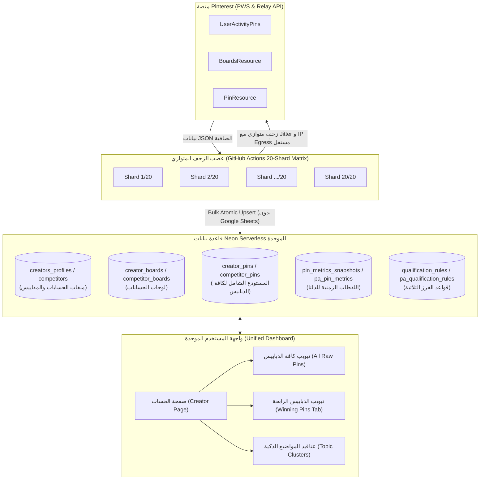

# الدليل المعماري والهندسي الشامل للمشروع (Master Blueprint)
> **الوثيقة المرجعية الموحدة لدمج مشروعي P2 (Competitors/Creators) و P4 (PinArchive/Winning Pins)**  
> **الاستغناء التام عن Google Sheets والاعتماد المطلق على Neon Serverless Postgres و GitHub Actions Matrix Sharding**  
> **المرجع الأساسي:** [sayfedin-star/pinorbit-v2](https://github.com/sayfedin-star/pinorbit-v2) & [sayfedin-star/pin-arbitrage-engine](https://github.com/sayfedin-star/pin-arbitrage-engine)

---

# 1. الميثاق المعماري والمبادئ الأساسية (The Architecture Charter)



### أولاً: أسباب الاستغناء التام عن Google Sheets والبديل المعتمد
1. **القضاء على اختناقات الـ Deadlocks والـ TabMutex**:
   - في المشاريع السابقة، كان الاعتماد على Sheets يفرض استخدام طوابير انتظار معقدة (FIFO Mutex) وتأخيرات لتفادي تجاوز حصة Google (100 طلب/دقيقة)، مما كان يسبب تجمد خطوط الأنابيب (Pipeline Hang).
2. **السرعة اللحظية (Sub-Millisecond Querying)**:
   - تم استبدال الـ Sheets بالكامل بـ **Neon Serverless Postgres** المعتمد على التخزين المتصل بشبكة التخزين المؤقت، حيث تنفذ استعلامات الفلترة والفرز في **أقل من 2 ميلي ثانية** بدلاً من ثوانٍ عبر واجهات Google Sheets API v4.
3. **سلامة وتماسك البيانات (ACID & Constraints)**:
   - يتيح PostgreSQL استخدام المفاتيح الفريدة (`UNIQUE constraints`)، والفهارس المتجهة (`GIN Indexes`)، والزنادات الذرية (`Monotonic Triggers`) لمنع تكرار المنشورات وضمان عدم تراجع العدادات أبداً.

---

### ثانياً: دمج P2 و P4 في منصة موحدة واحدة (Unified Engine)
بدلاً من تشغيل مستودعين منفصلين:
- **مشروع P2** (متابعة المنافسين والوصول الشهري واللوحات) أصبح هو **طبقة الحسابات الأساسية (`creators`)**.
- **مشروع P4** (أرشفة الدبابيس والعناقيد واستخراج الفائزين) أصبح هو **مستودع المنشورات الذكي المرتبط بكل حساب**.
- **القاعدة الذهبية في المشروع الجديد**:
  > **يتم زحف وحفظ كامل دبابيس الحساب (All Pins) دون استثناء في جدول المنشورات، بينما يتم تخصيص تبويب منفصل داخل صفحة الحساب لفرز المنشورات التي حققت شروط التأهيل (Qualified Winning Pins) لحظياً**.

---

# 2. المخطط الشامل لقاعدة البيانات (Neon Postgres Unified Schema)

```sql
-- ============================================================================
-- 1. جدول ملفات المبدعين / المنافسين الموحد (Creators & Competitors)
-- ============================================================================
CREATE TABLE IF NOT EXISTS creator_profiles (
    id SERIAL PRIMARY KEY,
    username VARCHAR(128) UNIQUE NOT NULL,
    display_name VARCHAR(255),
    avatar_url TEXT,
    bio TEXT,
    website_url TEXT,
    monthly_reach BIGINT DEFAULT 0,
    reach_delta_7d BIGINT DEFAULT 0,
    profile_views BIGINT DEFAULT 0,
    views_delta_7d BIGINT DEFAULT 0,
    total_pins INT DEFAULT 0,
    total_boards INT DEFAULT 0,
    follower_count INT DEFAULT 0,
    following_count INT DEFAULT 0,
    account_type VARCHAR(32) DEFAULT 'competitor', -- own | competitor | tracked
    activity_status VARCHAR(64) DEFAULT 'active',
    last_synced_at TIMESTAMPTZ,
    last_harvest_metadata JSONB DEFAULT '{}'::jsonb,
    is_active BOOLEAN DEFAULT TRUE,
    created_at TIMESTAMPTZ DEFAULT NOW(),
    updated_at TIMESTAMPTZ DEFAULT NOW()
);

CREATE INDEX IF NOT EXISTS idx_creators_reach ON creator_profiles(monthly_reach DESC);
CREATE INDEX IF NOT EXISTS idx_creators_sync ON creator_profiles(is_active, last_synced_at ASC NULLS FIRST);

-- ============================================================================
-- 2. جدول لوحات الحساب (Creator Boards)
-- ============================================================================
CREATE TABLE IF NOT EXISTS creator_boards (
    id SERIAL PRIMARY KEY,
    creator_id INT NOT NULL REFERENCES creator_profiles(id) ON DELETE CASCADE,
    board_id VARCHAR(64) NOT NULL,
    name VARCHAR(255) NOT NULL,
    url TEXT,
    pin_count INT DEFAULT 0,
    follower_count INT DEFAULT 0,
    last_pinned_at TIMESTAMPTZ,
    metadata JSONB DEFAULT '{}'::jsonb,
    created_at TIMESTAMPTZ DEFAULT NOW(),
    updated_at TIMESTAMPTZ DEFAULT NOW(),
    UNIQUE(creator_id, board_id)
);

CREATE INDEX IF NOT EXISTS idx_boards_creator ON creator_boards(creator_id);

-- ============================================================================
-- 3. المستودع الشامل لجميع دبابيس الحساب (All Pins Ingested)
-- ============================================================================
CREATE TABLE IF NOT EXISTS creator_pins (
    pin_id VARCHAR(64) PRIMARY KEY,
    creator_id INT REFERENCES creator_profiles(id) ON DELETE SET NULL,
    account_username VARCHAR(128) NOT NULL,
    title TEXT,
    description TEXT,
    link TEXT,
    domain VARCHAR(255),
    board_name VARCHAR(255),
    image_url TEXT,
    dominant_color VARCHAR(32) DEFAULT '#888888',
    saves BIGINT DEFAULT 0,
    repins BIGINT DEFAULT 0,
    comments INT DEFAULT 0,
    share_count BIGINT DEFAULT 0,
    reactions JSONB DEFAULT '{}'::jsonb,
    velocity NUMERIC(10, 2) DEFAULT 0,
    annotations JSONB DEFAULT '[]'::jsonb,
    is_video BOOLEAN DEFAULT FALSE,
    is_product BOOLEAN DEFAULT FALSE,
    created_at_pinterest TIMESTAMPTZ,
    first_seen_at TIMESTAMPTZ DEFAULT NOW(),
    last_updated_at TIMESTAMPTZ DEFAULT NOW()
);

CREATE INDEX IF NOT EXISTS idx_pins_username ON creator_pins(account_username);
CREATE INDEX IF NOT EXISTS idx_pins_creator_id ON creator_pins(creator_id);
CREATE INDEX IF NOT EXISTS idx_pins_saves ON creator_pins(saves DESC);
CREATE INDEX IF NOT EXISTS idx_pins_repins ON creator_pins(repins DESC);
CREATE INDEX IF NOT EXISTS idx_pins_velocity ON creator_pins(velocity DESC);
CREATE INDEX IF NOT EXISTS idx_pins_date ON creator_pins(created_at_pinterest DESC NULLS LAST);
CREATE INDEX IF NOT EXISTS idx_pins_annotations_gin ON creator_pins USING gin(annotations);

-- ============================================================================
-- 4. زناد الأرقام المتزايدة الصارم (Monotonic Trigger)
-- يمنع هبوط أرقام الحفظ أو إعادة النشر في قاعدة البيانات نهائياً
-- ============================================================================
CREATE OR REPLACE FUNCTION trg_enforce_monotonic_metrics()
RETURNS trigger LANGUAGE plpgsql AS $$
BEGIN
  IF TG_OP = 'UPDATE' THEN
    NEW.saves := GREATEST(COALESCE(OLD.saves, 0), COALESCE(NEW.saves, 0));
    NEW.repins := GREATEST(COALESCE(OLD.repins, 0), COALESCE(NEW.repins, 0));
    NEW.comments := GREATEST(COALESCE(OLD.comments, 0), COALESCE(NEW.comments, 0));
    NEW.share_count := GREATEST(COALESCE(OLD.share_count, 0), COALESCE(NEW.share_count, 0));
  END IF;
  RETURN NEW;
END;
$$;

DROP TRIGGER IF EXISTS trg_pins_monotonic ON creator_pins;
CREATE TRIGGER trg_pins_monotonic
  BEFORE UPDATE ON creator_pins
  FOR EACH ROW EXECUTE FUNCTION trg_enforce_monotonic_metrics();

-- ============================================================================
-- 5. جدول السلاسل الزمنية الحقيقية للدلتا (Pin Time-Series Metrics)
-- بديل المعادلات الرياضية التقديرية لحساب الزيادة الحقيقية
-- ============================================================================
CREATE TABLE IF NOT EXISTS pin_metrics_snapshots (
    id BIGSERIAL PRIMARY KEY,
    pin_id VARCHAR(64) NOT NULL REFERENCES creator_pins(pin_id) ON DELETE CASCADE,
    recorded_at TIMESTAMPTZ DEFAULT NOW(),
    saves BIGINT DEFAULT 0,
    repins BIGINT DEFAULT 0,
    comments INT DEFAULT 0,
    UNIQUE(pin_id, recorded_at)
);

CREATE INDEX IF NOT EXISTS idx_pin_metrics_lookup ON pin_metrics_snapshots(pin_id, recorded_at DESC);

-- ============================================================================
-- 6. جدول قواعد التأهيل المعتمدة (Qualification Rules)
-- ============================================================================
CREATE TABLE IF NOT EXISTS qualification_rules (
    id INT PRIMARY KEY DEFAULT 1,
    tier1_min_saves INT DEFAULT 100,        -- النجوم المستقرة
    tier2_min_repins INT DEFAULT 100,       -- الانتشار الفيروسي
    tier3_max_age_days INT DEFAULT 14,      -- حداثة المنشور (أقل من أسبوعين)
    tier3_min_saves INT DEFAULT 25,         -- حفظ المنشورات الحديثة
    master_ingest_enabled BOOLEAN DEFAULT TRUE,
    early_stop_pages INT DEFAULT 3,         -- صفحات المراقبة اليومية
    discovery_max_pages INT DEFAULT 500,    -- أقصى عمق للباكفيل
    updated_at TIMESTAMPTZ DEFAULT NOW(),
    CONSTRAINT single_rules_row CHECK (id = 1)
);

INSERT INTO qualification_rules (id) VALUES (1) ON CONFLICT (id) DO NOTHING;
```

---

# 3. محاور خطوط الأنابيب الثلاثية (Discovery, Refresh & Sweep Engine)

| العملية | العمق المستهدف | التكرار | الغرض وسلوك الزحف |
|---|---|---|---|
| **1. الاستكشاف (Discovery / Deep Ingest)** | حتى **500 صفحة** | عند إضافة حساب جديد أو بطلب يدوي | جلب الأرشيف التاريخي الكامل للحساب، واستخراج كافة لوحاته، وبناء العناقيد الدلالية (Topic Clusters). |
| **2. المراقبة والتحديث (Refresh / Early-Stop)** | أول **3 صفحات** فقط | كل 24 ساعة عبر Cron | اقتناص الدبابيس الجديدة التي نُشرت حديثاً، ورصد القفزات اللحظية في التفاعل بأقل استهلاك شبكي. |
| **3. التدقيق والمسح الشامل (Sweep & Audit)** | مسح داخلي بقاعدة البيانات | دوري (أسبوعي/شهري) | مراجعة مقاييس اللقطات التاريخية، وحساب سرعة الحفظ اليومية (`velocity`)، وإعادة تقييم الدبابيس الرابحة عند تعديل شروط التأهيل. |

### كيفية فرز الدبابيس داخل صفحة الحساب (Account Dossier Tabs):
داخل صفحة الحساب، يتم عرض تبويبين أساسيين:
1. **تبويب كافة الدبابيس (`All Pins`)**: يعرض جميع المنشورات التي جلبها الزاحف بدون أي استثناء (100% Raw Data).
2. **تبويب الدبابيس الرابحة (`Winning Pins`)**: يستعلم فورياً عن المنشورات التي تطابق قاعدة **(3-Tier OR Qualification Criteria)**:
   ```sql
   SELECT *
   FROM creator_pins
   WHERE account_username = ${targetUsername}
     AND (
       saves >= ${tier1_min_saves}                               -- Tier 1
       OR repins >= ${tier2_min_repins}                          -- Tier 2
       OR (                                                      -- Tier 3
         created_at_pinterest IS NOT NULL
         AND EXTRACT(EPOCH FROM (NOW() - created_at_pinterest))/86400 <= ${tier3_max_age_days}
         AND saves >= ${tier3_min_saves}
       )
     )
   ORDER BY saves DESC;
   ```

---

# 4. الشرح المفصل لنظام GitHub Actions (Distributed Matrix Crawler)

### لماذا GitHub Actions وليس Cloudflare Workers للزحف؟
1. **التحرر من قيود المهل الزمنية (Unbound Execution Time)**:
   - تسمح خوادم GitHub Actions للمهمة بالعمل حتى **60 دقيقة** كاملة لكل Shard، مقارنة بـ 30 ثانية في Cloudflare Workers.
2. **توزيع عناوين الـ IP (Decentralized Egress IPs)**:
   - عند تشغيل 20 معالجاً في GitHub Actions، يحصل كل معالج على خادم Ubuntu مستقل تماماً بعنوان IP من مراكز بيانات مختلفة لشركة Microsoft Azure، مما يوزع الحمل ويجعل حظر الـ IP من طرف Pinterest مستحيلاً تقريباً.
3. **التوازي الفائق والمجاني (20x Parallel Matrix)**:
   - معالجة مئات الحسابات وآلاف اللوحات بالتوازي في وقت قياسي دون حجز سيرفرات مدفوعة (VPS).

---

### ملف سير العمل الكامل والمضبوط: `.github/workflows/crawler-pipeline.yml`

```yaml
name: Distributed Crawler & Intelligence Pipeline

on:
  schedule:
    # يعمل تلقائياً كل يوم في تمام الساعة 04:00 بتوقيت UTC
    - cron: '0 4 * * *'
  workflow_dispatch:
    inputs:
      target_account:
        description: 'اسم حساب محدد لزحفه فوراً (اتركه فارغاً لفحص كامل طابور الحسابات المجدولة)'
        required: false
        type: string
        default: ''
      crawl_mode:
        description: 'نوع العملية: refresh (توقف مبكر 3 صفحات) أو discovery (باكفيل عميق 500 صفحة)'
        required: true
        type: choice
        options:
          - refresh
          - discovery
        default: 'refresh'
      max_pages:
        description: 'أقصى عدد صفحات (للتخصيص اليدوي)'
        required: false
        type: string
        default: '3'

concurrency:
  group: cluster-intelligence-${{ github.workflow }}-${{ github.ref }}
  cancel-in-progress: false

jobs:
  crawl-shards:
    name: Crawl Shard ${{ matrix.shard }}/20
    runs-on: ubuntu-latest
    timeout-minutes: 60
    strategy:
      fail-fast: false       # إذا فشل شارد واحد لا تتوقف بقية الشاردات الـ 19
      max-parallel: 20       # تشغيل الـ 20 معالجاً في نفس اللحظة بالتوازي التام
      matrix:
        shard: [1, 2, 3, 4, 5, 6, 7, 8, 9, 10, 11, 12, 13, 14, 15, 16, 17, 18, 19, 20]

    steps:
      - name: 1. تنزيل كود المستودع
        uses: actions/checkout@v4

      - name: 2. إعداد بيئة Node.js 22 الحديثة
        uses: actions/setup-node@v4
        with:
          node-version: 22
          cache: 'npm'

      - name: 3. التحقق من عنوان الآي بي الخاص بالشارد (Egress IP Diagnostics)
        run: |
          echo "=== Shard ${{ matrix.shard }}/20 Egress IP ==="
          curl -s https://api.ipify.org && echo ""
          echo "=============================================="

      - name: 4. تثبيت التبعيات الصافية
        run: npm ci

      - name: 5. تنفيذ محرك الزحف الموزع
        env:
          DATABASE_URL: ${{ secrets.DATABASE_URL }}
          PINTEREST_COOKIE: ${{ secrets.PINTEREST_COOKIE }}
          TARGET_ACCOUNT: ${{ inputs.target_account }}
          CRAWL_MODE: ${{ inputs.crawl_mode || 'refresh' }}
          MAX_PAGES: ${{ inputs.max_pages || '3' }}
          SHARD_NUMBER: ${{ matrix.shard }}
          SHARD_TOTAL: 20
        run: node scripts/crawler-engine.mjs
```

---

### خوارزمية تقسيم المهام الحسابية في كود Node.js (Modulo Sharding Logic)

```javascript
// scripts/crawler-engine.mjs

export async function getAccountsAssignedToShard(sql, shardNumber, shardTotal) {
  // 1. جلب الحسابات النشطة مرتبة بحسب الأقدم فحصاً (Round-Robin FIFO)
  const allAccounts = await sql`
    SELECT id, username, last_synced_at
    FROM creator_profiles
    WHERE is_active = TRUE
    ORDER BY last_synced_at ASC NULLS FIRST, id ASC;
  `;

  if (!shardNumber || !shardTotal || shardTotal <= 1) {
    return allAccounts; // تشغيل محلي فردي
  }

  const shardIndex = shardNumber - 1; // تحويل من 1-indexed إلى 0-indexed

  // 2. تقسيم الحسابات باستخدام باقي القسمة الحسابي الحتمي (Modulo)
  const assignedAccounts = allAccounts.filter((_, idx) => (idx % shardTotal) === shardIndex);

  console.log(`[Matrix Sharding] Shard ${shardNumber}/${shardTotal}: تم إسناد ${assignedAccounts.length} حساب من أصل ${allAccounts.length}.`);
  return assignedAccounts;
}
```

---

# 5. طبقة الهندسة العكسية والصمود ضد الحظر (Anti-Bot & Scraping Resiliency)

### 1. ترويسات متصفح Chrome 151 و PWS Headers
```javascript
export function getPinterestHeaders(username, cookie = '') {
  const cleanUser = String(username).replace(/^@/, '').trim();
  const src = `/${cleanUser}/_created/`;

  const headers = {
    'User-Agent': 'Mozilla/5.0 (Windows NT 10.0; Win64; x64) AppleWebKit/537.36 (KHTML, like Gecko) Chrome/151.0.0.0 Safari/537.36',
    'Accept': 'application/json, text/javascript, */*; q=0.01',
    'Accept-Language': 'en-US,en;q=0.9',
    'sec-ch-ua': '"Not=A?Brand";v="99", "Google Chrome";v="151", "Chromium";v="151"',
    'sec-ch-ua-mobile': '?0',
    'sec-ch-ua-platform': '"Windows"',
    'X-Requested-With': 'XMLHttpRequest',
    'X-App-Version': '9302641',
    'X-Pinterest-AppState': 'active',
    'X-Pinterest-PWS-Handler': `www/${cleanUser}/_created.js`,
    'X-Pinterest-Source-Url': src,
    'Referer': `https://www.pinterest.com${src}`
  };

  if (cookie && cookie.trim()) {
    headers['Cookie'] = cookie.trim();
  }
  return headers;
}
```

### 2. صمام الأمان (Jitter Delays & Explicit Timeouts)
- إرسال كل طلب مصحوباً بـ `AbortSignal.timeout(8000)` لمنع تعليق المقابس (Socket Leaks).
- حقن تأخير عشوائي بين الصفحات:
  ```javascript
  const sleep = (ms) => new Promise(r => setTimeout(r, ms));
  const jitter = () => 2500 + Math.floor(Math.random() * 1500); // بين 2.5 إلى 4 ثوانٍ
  ```
- عند استلام كود `HTTP 429` أو `HTTP 403`:
  - إيقاف التنفيذ فوراً لمدة عشوائية ثم المحاولة بدون كوكيز (Anonymous Fallback).

---

# 6. خارطة طريق تسليم ونقل المشروع (Handover Action Items)

1. **إعداد قاعدة البيانات**:
   - تشغيل سكريبت إنشاء الجداول الموحد المذكور في **القسم رقم 2** على قاعدة بيانات Neon.
2. **استنساخ ملفات النواة الصلبة**:
   - نقل ملف `scripts/lib/pinterest.mjs` كحزمة مستقلة مسؤولة عن استخراج بيانات Pinterest.
3. **تثبيت ملف GitHub Actions**:
   - وضع ملف الـ YAML المشروح في **القسم رقم 4** داخل مجلد `.github/workflows/`.
   - إضافة المتغيرين السريين في إعدادات مستودع GitHub:
     - `DATABASE_URL` (رابط اتصال Neon المشترك المجمع `pooler`).
     - `PINTEREST_COOKIE` (جلسة Pinterest لضمان سحب الرسوم البيانية الكاملة).
4. **بناء صفحة الحساب (Creator Page)**:
   - تصميم واجهة الحساب بحيث تستدعي مساراً بسيطاً وواضحاً:
     - `GET /api/creators/:username/pins?tab=all` لعرض كافة الدبابيس المحصودة.
     - `GET /api/creators/:username/pins?tab=winning` لعرض الدبابيس التي تجاوزت معايير التأهيل الثلاثية فقط.
