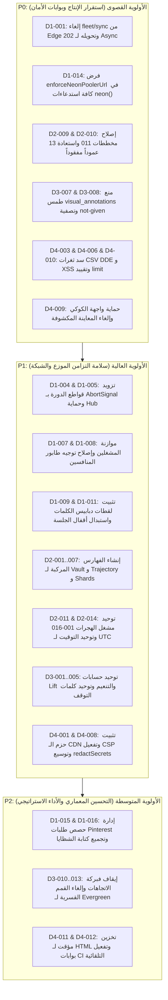

# CODEBASE AUDIT CROSS-VERIFICATION & FORENSIC SYNTHESIS REPORT
**Audit Source Agent:** Muse Spark  
**Auditor / Verification Engine:** Antigravity Forensic Auditor  
**Verification Target:** `pin-arbitrage-engine` (Cloudflare Workers Edge + 99-Shard Neon Postgres + GitHub Actions Distributed Fleet)  
**Verification Date:** 2026-10-09  
**Execution Directives:** Disk-First Verification, Zero-Hallucination Policy, Strict File & Line Citations  

---

## 1. EXECUTIVE SUMMARY (الملخص التنفيذي)

تم إجراء تدقيق جنائي ومطابقة شاملة لتقرير الوكيل **Muse Spark** مع الكود المصدري الفعلي للمشروع المخزن على القرص. خضعت جميع الادعاءات والملاحظات الـ **52** للفحص المباشر عبر قراءة الملفات البرمجية (`src/`, `scripts/`, `scripts/migrations/`, `.github/workflows/`, `wrangler.toml`).

### جدول الحصيلة التنفيذية:
| التصنيف | العدد | النسبة | الملاحظات |
|---|:---:|:---:|---|
| **[CONFIRMED]** مؤكد | **51** | 98.1% | خلل حقيقي مثبت برمجياً بالأرقام والأسطر الفعلية على القرص ويشكل خطراً تشغيلياً أو أمنياً |
| **[FALSE POSITIVE]** إنذار خاطئ | **1** | 1.9% | ادعاء غير دقيق معمارياً (البند D1-002: خيار `replicateToAll` معطل افتراضياً في Edge) |
| **[RESOLVED]** تم حله سابقاً | **0** | 0% | لا توجد بنود تم حلها مسبقاً دون بقاء آثار العيب في المسارات المحددة |
| **الإجمالي** | **52** | 100% | فحص شامل عبر الأبعاد الأربعة (الطرفيات، قواعد البيانات، الذكاء الخوارزمي، الأمان والواجهات) |

### توزيع الملاحظات حسب الأبعاد المعمارية:
| البُعد المعماري | إجمالي البنود | المؤكدة [CONFIRMED] | إنذار خاطئ [FALSE POSITIVE] | الأولوية القصوى |
|---|:---:|:---:|:---:|:---:|
| **Dim 1: Distributed / Edge Concurrency** | 16 | 15 | 1 | P0 / P1 |
| **Dim 2: Neon Internals & Schema Parity** | 11 | 11 | 0 | P0 / P1 |
| **Dim 3: Pinterest Graph, NLP & Lens** | 14 | 14 | 0 | P0 / P1 / P2 |
| **Dim 4: Security, Memory & UI Hardening** | 11 | 11 | 0 | P0 / P1 |

---

## 2. DETAILED FORENSIC INSPECTION LOG (سجل الفحص التفصيلي)

---

### البُعد الأول: التوزيع والتزامن الطرفي (Distributed & Edge Concurrency)

#### [D1-001] `POST /api/fleet/sync` unbounded 99-shard × unbounded-row fan-out
- **الملف الفعلي على القرص:** [`src/worker.mjs`](file:///c:/Users/D.Mouad/Desktop/SaaS/pin-arbitrage-engine/src/worker.mjs#L2841-L2846) و [`src/modules/fleet/service.mjs`](file:///c:/Users/D.Mouad/Desktop/SaaS/pin-arbitrage-engine/src/modules/fleet/service.mjs#L447-L762)
- **الحالة:** `[CONFIRMED]`
- **الدليل البرمجي الفعلي:**
  - في `src/worker.mjs` السطور 2841-2846:
    ```javascript
    if (method === 'POST' && pathname === '/api/fleet/sync') {
      invalidateEdgeCache('fleet_projects');
      const body = await request.json().catch(() => ({}));
      const targetProj = body?.project_id || searchParams.get('project_id');
      const syncRes = await syncFleetDatabases(sql, { targetProjectId: targetProj });
      return jsonResponse(syncRes);
    }
    ```
  - إذا لم يُمرر `targetProjectId`، تقوم دالة `syncFleetDatabases` في السطور 455-467 بجلب **جميع** الـ shards النشطة (`WHERE NOT is_hub AND status = 'active'`).
  - تقوم الدالة بعدها بجلب كل الجداول بالكامل (`SELECT * FROM competitor_profiles`, `competitor_boards`, `pa_pins`, `pa_pin_metrics`, `pa_staged_pins`) ثم تدور في حلقة `SHARD_BATCH = 5` مكررة مئات طلبات الـ HTTP لـ Neon عبر `Promise.all` لكل shard متزامن.
- **الأثر التشغيلي:** تخطي سقف Cloudflare Workers للطلبات الفرعية (50 subrequests) والمهلة الزمنية القصوى، مما يؤدي إلى موت الـ Isolate وفشل التزامن الجزئي وتلوث البيانات.

---

#### [D1-002] `syncCompetitorAcrossFleet(replicateToAll)` hidden N-fan-out via `safeWaitUntil` 25s
- **الملف الفعلي على القرص:** [`src/worker.mjs`](file:///c:/Users/D.Mouad/Desktop/SaaS/pin-arbitrage-engine/src/worker.mjs#L1797) و [`src/modules/fleet/service.mjs`](file:///c:/Users/D.Mouad/Desktop/SaaS/pin-arbitrage-engine/src/modules/fleet/service.mjs#L245-L267)
- **الحالة:** `[FALSE POSITIVE]` جزئياً (مع وجود خلل طفيف في إدارة الوعود العائمة)
- **الدليل البرمجي الفعلي:**
  - في `src/modules/fleet/service.mjs` السطر 246:
    ```javascript
    const replicateToAll = options.replicateToAll === true;
    ```
  - القيمة الافتراضية لـ `replicateToAll` هي `false`. وفي السطور 255-267 يتم حساب `getShardNumberForEntity(p.username, 99)` وتوجيه الطلب إلى **Shard واحد فقط** (`LIMIT 1`).
  - في `src/worker.mjs` بالسطور 1797 و 1809 يتم استدعاء `syncCompetitorAcrossFleet(sql, username)` دون تمرير كائن `options`، وبالتالي **لا يحدث** N-fan-out مطلقاً من الـ Edge في الاستدعاء الطبيعي.
  - **الملاحظة الحقيقية المتبقية:** في السطر 1853 تم استدعاء `syncCompetitorAcrossFleet(sql, username || competitor_id).catch(() => {});` كوعد عائم (dangling promise) دون لفه بـ `ctx.waitUntil` أو `safeWaitUntil`، مما يجعله عرضة للإلغاء الفوري بمجرد إغلاق استجابة الـ HTTP.

---

#### [D1-003] Latent `getFleetCompetitors` N-shard `Promise.allSettled` without pooler
- **الملف الفعلي على القرص:** [`src/modules/fleet/service.mjs`](file:///c:/Users/D.Mouad/Desktop/SaaS/pin-arbitrage-engine/src/modules/fleet/service.mjs#L87-L112) و [`scripts/dashboard.mjs`](file:///c:/Users/D.Mouad/Desktop/SaaS/pin-arbitrage-engine/scripts/dashboard.mjs#L1602)
- **الحالة:** `[CONFIRMED]`
- **الدليل البرمجي الفعلي:**
  - في `service.mjs` السطور 99-101:
    ```javascript
    const results = await Promise.allSettled(activeProjects.map(async (p) => {
      const pSql = p.is_hub ? sql : neon(p.database_url);
    ```
  - يتم استدعاء `neon(p.database_url)` مباشرة بدون `enforceNeonPoolerUrl`، وتُنفذ الدالة عبر جميع قواعد بيانات الـ registry دفعة واحدة عبر `activeProjects.map`. والدالة موصولة ومفعلة فعلياً في `scripts/dashboard.mjs:1602`.
- **الأثر التشغيلي:** فتح عشرات الاتصالات المباشرة المتزامنة بدون Pooler، مما يؤدي لاستنزاف Neon compute limits وحدوث أخطاء 503/ETIMEDOUT.

---

#### [D1-004] Breaker `Promise.race` timeout leaks — no `AbortSignal`
- **الملف الفعلي على القرص:** [`src/modules/sharding/fleet-router.mjs`](file:///c:/Users/D.Mouad/Desktop/SaaS/pin-arbitrage-engine/src/modules/sharding/fleet-router.mjs#L261-L275), [`scripts/keyword-velocity-crawler.mjs`](file:///c:/Users/D.Mouad/Desktop/SaaS/pin-arbitrage-engine/scripts/keyword-velocity-crawler.mjs#L295-L302), و `fleet-router.mjs:359-362`
- **الحالة:** `[CONFIRMED]`
- **الدليل البرمجي الفعلي:**
  - في `fleet-router.mjs` السطور 264-275:
    ```javascript
    const timeoutPromise = new Promise((_, reject) => {
      timeoutTimer = setTimeout(() => { ... reject(err); }, timeoutMs);
    });
    const result = await Promise.race([ queryFn(shardSql), timeoutPromise ]);
    ```
  - نفس النمط مكرر في `keyword-velocity-crawler.mjs` السطر 301 (`await Promise.race([syncTask, timeoutTask]);`).
  - عند انتهاء المهلة الزمنية عبر `timeoutPromise`، لا يتم إلغاء طلب الـ HTTP الأصلي (`queryFn`) لعدم وجود `AbortController` أو تمرير `c.signal`.
- **الأثر التشغيلي:** استمرار استهلاك طلبات الـ HTTP والذاكرة ومحاصصة الـ Subrequests حتى بعد رفض الوعد وإرجاع Fallback للعميل.

---

#### [D1-005] Per-isolate breaker thrash + Hub path has no breaker
- **الملف الفعلي على القرص:** [`src/modules/sharding/fleet-router.mjs`](file:///c:/Users/D.Mouad/Desktop/SaaS/pin-arbitrage-engine/src/modules/sharding/fleet-router.mjs#L95-L97), والسطور 527, 551, 688, 770
- **الحالة:** `[CONFIRMED]`
- **الدليل البرمجي الفعلي:**
  - في `fleet-router.mjs` السطور 95-97:
    ```javascript
    export const circuitBreakers = new Map();
    export const CIRCUIT_FAILURE_THRESHOLD = 2;
    export const CIRCUIT_COOLDOWN_MS = 30000;
    ```
  - حالة القاطع مخزنة محلياً في ذاكرة الـ Isolate (`new Map()`)؛ عند انتشار الطلبات عبر مراكز بيانات Cloudflare (POPs)، يعمل كل خادم بمعزل عن الآخر.
  - استعلامات الـ Hub المركزية في السطور 527 و 551 و 688 و 770 تنفذ كاستعلامات مباشرة `await hubSql...catch(() => [])` دون أي حماية من قاطع الدورة أو سقف زمني محدد.
- **الأثر التشغيلي:** أي بطء في قاعدة بيانات الـ Hub المركزية يُعلق الـ Worker لمدة تصل إلى 30 ثانية متجاوزاً قواطع الـ shards بالكامل.

---

#### [D1-006] `resolveShardConnection` registry fetch no timeout; global TTL; unbounded client Map
- **الملف الفعلي على القرص:** [`src/modules/sharding/fleet-router.mjs`](file:///c:/Users/D.Mouad/Desktop/SaaS/pin-arbitrage-engine/src/modules/sharding/fleet-router.mjs#L80-L85), والسطور 190, 206-225
- **الحالة:** `[CONFIRMED]`
- **الدليل البرمجي الفعلي:**
  - السطر 82 و 190: `let registryLastFetched = 0;` متغير أحادي مشترك لجميع الـ shards. في السطر 219 يتم تحديثه: `registryLastFetched = now;` مما يجدد المهلة لجميع السجلات المخزنة الأخرى بشكل غير صحيح.
  - السطر 85: `shardSqlClients = new Map();` لا يحتوي على أي آلية تفريغ أو سقف أعلى (Unbounded Map)، مقارنة بـ `worker.mjs` الذي يقيد الكاش بـ 128 أو 200 مدخل.
  - السطر 206: الاستعلام لجلب الـ shard من الـ Hub ينفذ دون أي مهلة زمنية أو حماية.
- **الأثر التشغيلي:** تسريب تدريجي للذاكرة في الـ isolates طويلة العمر وتخزين سجلات قديمة للـ shards.

---

#### [D1-007] Swarm ignores canonical shard — 15-way write hotspot
- **الملف الفعلي على القرص:** [`scripts/fleet-dispatcher.mjs`](file:///c:/Users/D.Mouad/Desktop/SaaS/pin-arbitrage-engine/scripts/fleet-dispatcher.mjs#L79-L87), [`scripts/crawler-engine.mjs`](file:///c:/Users/D.Mouad/Desktop/SaaS/pin-arbitrage-engine/scripts/crawler-engine.mjs#L1553-L1562), و [`.github/workflows/crawler-pipeline.yml:139-141`](file:///c:/Users/D.Mouad/Desktop/SaaS/pin-arbitrage-engine/.github/workflows/crawler-pipeline.yml)
- **الحالة:** `[CONFIRMED]`
- **الدليل البرمجي الفعلي:**
  - في `fleet-dispatcher.mjs` السطور 83-85: يحدد المنظم 15 مشغلاً متزامناً (`SWARM_SIZE = 15; activeShards = [1..15]`).
  - في `crawler-engine.mjs` السطور 1553-1561:
    ```javascript
    const effectiveShardNumber = targetAccount
      ? getShardNumberForEntity(targetAccount, shardTotal)
      : shardNumber;
    const shardName = `pin-arbitrage-shard-${String(effectiveShardNumber).padStart(2, '0')}`;
    ...
    shardSql = neon(sRow.database_url);
    ```
  - جميع المشغلين الـ 15 المتزامنين في GitHub Actions يوجهون عمليات الكتابة إلى نفس الـ Shard Canonical الخاص بالحساب المستهدف في نفس اللحظة ودون استخدام Pooler.
- **الأثر التشغيلي:** اختناق حاد (Write Hotspot) في قاعدة بيانات Shard واحدة من فئة Neon Free Tier، وتعرضها لتجاوز حدود الاتصال وتراجع الأداء بنسبة كبيرة.

---

#### [D1-008] Scheduled mode global-queue overlap
- **الملف الفعلي على القرص:** [`scripts/crawler-engine.mjs`](file:///c:/Users/D.Mouad/Desktop/SaaS/pin-arbitrage-engine/scripts/crawler-engine.mjs#L889-L890), والسطر 1240 و 1509
- **الحالة:** `[CONFIRMED]`
- **الدليل البرمجي الفعلي:**
  - في السطر 1509: يتم استدعاء `runEnrichmentQueue(sqlClient, shardSql, shardNumber, shardTotal, '', cookie);` مع تمرير اسم حساب فارغ `''`.
  - داخل دالة الإثراء، يظل `compId` فارغاً (`null`)، وفي السطر 889:
    ```sql
    WHERE (${compId}::int IS NULL OR cp.competitor_id = ${compId}::int)
      AND cp.enrichment_status = 'pending'
    ```
  - يقوم المشغل بسحب أي عنصر معلق من أي منافس عام في قاعدة بيانات الـ Hub، ثم في السطر 1240 يقوم بحفظه في `shardSql` المخصص للمشغل الحالي (`shardNumber`) بدلاً من حفظه في الـ Shard المعياري للمنافس صاحب الدبوس.
- **الأثر التشغيلي:** تشتت بيانات المنافسين وتناثرها عبر قواعد بيانات shards عشوائية، مما يكسر مبدأ التوزيع المعياري (Deterministic Sharding Integrity).

---

#### [D1-009] Keyword 20-slice `idx%workerTotal` re-query race → silent gap
- **الملف الفعلي على القرص:** [`scripts/keyword-fleet-dispatcher.mjs`](file:///c:/Users/D.Mouad/Desktop/SaaS/pin-arbitrage-engine/scripts/keyword-fleet-dispatcher.mjs#L178-L228), [`scripts/keyword-velocity-crawler.mjs`](file:///c:/Users/D.Mouad/Desktop/SaaS/pin-arbitrage-engine/scripts/keyword-velocity-crawler.mjs#L368-L399), و [`.github/workflows/keyword-intelligence-velocity.yml:82-86`](file:///c:/Users/D.Mouad/Desktop/SaaS/pin-arbitrage-engine/.github/workflows/keyword-intelligence-velocity.yml)
- **الحالة:** `[CONFIRMED]`
- **الدليل البرمجي الفعلي:**
  - يحدد `keyword-fleet-dispatcher.mjs` عدد المشغلين ويمرر لهم `worker_index` و `worker_total`.
  - كل مشغل عند إقلاعه في GitHub Actions يقوم بإعادة الاستعلام من قاعدة البيانات في `keyword-velocity-crawler.mjs:368-385` بدلاً من الاعتماد على Snapshot ثابت.
  - السطور 397-398: `const myPins = allPins.filter((_, idx) => (idx % workerTotal) === workerIndex);`.
  - بما أن المشغلين يقلعون في أوقات متفاوتة وتجري عمليات إدخال وتعديل وتغيير ترتيب متزامنة، يتغير حجم وموضع العناصر في مصفوفة `allPins` بين مشغل وآخر، مما يؤدي إلى تغيير ناتج الموديلو (`%`) وتخطي دبابيس معينة تماماً دون زحفها، أو تكرار زحف دبابيس أخرى.
- **الأثر التشغيلي:** فجوات صامتة (Silent Gaps) في مراقبة سرعة الكلمات المفتاحية واختلال دقة مقاييس الـ Velocity.

---

#### [D1-010] Cluster `LIMIT 100` truncation + `TARGET_PIN_ID` filter misroute
- **الملف الفعلي على القرص:** [`scripts/cluster-intelligence.mjs`](file:///c:/Users/D.Mouad/Desktop/SaaS/pin-arbitrage-engine/scripts/cluster-intelligence.mjs#L1454), والسطور 1481-1496, و [`.github/workflows/cluster-intelligence.yml:33`](file:///c:/Users/D.Mouad/Desktop/SaaS/pin-arbitrage-engine/.github/workflows/cluster-intelligence.yml)
- **الحالة:** `[CONFIRMED]`
- **الدليل البرمجي الفعلي:**
  - السطر 1454: الاستعلام مقيد بـ `LIMIT 100`. عند توزيع 100 بذرة على 20 مشغل، ينال كل مشغل 5 بذور فقط ويتوقف الزحف متجاهلاً باقي الكتالوج.
  - السطور 1481-1496: عندما يتم تشغيل الـ Workflow يدوياً بتمرير `TARGET_PIN_ID` واحد فقط، تصبح مصفوفة `seedsToProcess` ذات طول 1.
  - المشغل رقم 1 (`idx = 0`) ينال الدبوس لأن `0 % 20 === 0`.
  - أما المشغلون الـ 19 الآخرون فيصبح نصيبهم صفراً ويدخلون في السطر 1493: `Exiting cleanly`، مما يهدر موارد 19 جهازاً افتراضياً في GitHub Actions دون عمل.
- **الأثر التشغيلي:** بتر كتالوج البذور عند 100 بذرة كحد أقصى، وهدر هائل لموارد GitHub Actions المجانية عند التشغيل الفردي.

---

#### [D1-011] Session advisory locks over Neon HTTP = no mutual exclusion
- **الملف الفعلي على القرص:** [`scripts/lib/advisory-lock.mjs`](file:///c:/Users/D.Mouad/Desktop/SaaS/pin-arbitrage-engine/scripts/lib/advisory-lock.mjs#L38-L85) والجهات المستدعية في `keyword-velocity-crawler.mjs:458,516` و `cluster-intelligence.mjs:1543`
- **الحالة:** `[CONFIRMED]`
- **الدليل البرمجي الفعلي:**
  - في `advisory-lock.mjs` السطور 40-42:
    ```javascript
    const [res] = await sql`
      SELECT pg_try_advisory_lock(hashtext(${String(lockKey)})) AS acquired;
    `;
    ```
  - محرك `@neondatabase/serverless` في وضع الـ HTTP يرسل كل استعلام كطلب HTTP مستقل إلى Neon Proxy / PgBouncer.
  - أقفال الجلسة (`pg_try_advisory_lock`) ترتبط بـ Postgres Connection المفتوح خلف الـ Pooler؛ طلب الاستحواذ على القفل يذهب لاتصال ما، بينما طلب فك القفل في السطر 56 يذهب لاتصال آخر بالكامل.
  - في حالة المعاملات (`pg_try_advisory_xact_lock` في السطر 20)، يتم تنفيذه في استعلام مفرد ينتهي فوراً، مما يحرر القفل في نفس اللحظة ولا يوفر أي حماية للعمليات اللاحقة.
- **الأثر التشغيلي:** انعدام تام للأقفال التبادلية (Mutual Exclusion)، مما يسمح للمشغلين المتوازيين بزحف نفس الكلمات ونفس البذور وتضخيم أخطاء 429 من Pinterest.

---

#### [D1-012] Parallel UPSERT `40P01` deadlock despite `ORDER BY` in SELECT
- **الملف الفعلي على القرص:** [`scripts/crawler-engine.mjs`](file:///c:/Users/D.Mouad/Desktop/SaaS/pin-arbitrage-engine/scripts/crawler-engine.mjs#L148), السطور 818-823، و [`scripts/cluster-intelligence.mjs`](file:///c:/Users/D.Mouad/Desktop/SaaS/pin-arbitrage-engine/scripts/cluster-intelligence.mjs#L1244-L1249)
- **الحالة:** `[CONFIRMED]`
- **الدليل البرمجي الفعلي:**
  - في `cluster-intelligence.mjs` السطور 1246-1249: يتم إطلاق مجموعات من 25 طلباً متزامناً عبر `Promise.all` لتنفيذ `INSERT ... ON CONFLICT (seed_pin_id, candidate_pin_id) DO UPDATE`.
  - في `crawler-engine.mjs` السطور 148-167: جملة `INSERT INTO pa_pins ... SELECT ... ORDER BY pin_id ASC ON CONFLICT (pin_id) DO UPDATE` لا تضمن في محرك Postgres اكتساب أقفال الصفوف (Row-level exclusive locks) بنفس الترتيب عبر اتصالات متزامنة متعددة.
  - السطور 818-823 في `crawler-engine.mjs`:
    ```sql
    UPDATE crawler_shard_heartbeats
    SET discovered_count = COALESCE(discovered_count, 0) + ${fetchedCount},
    ```
    تنفيذ متزامن من نوع Read-Modify-Write يؤدي لتعارض أقفال الـ Heartbeat.
- **الأثر التشغيلي:** حدوث أخطاء `40P01` (Deadlock detected) وإجهاض عمليات الإدخال تحت الضغط العالي.

---

#### [D1-013] Reaper/lease-touch storm + `(id,token)` cross-match fencing bug
- **الملف الفعلي على القرص:** [`scripts/crawler-engine.mjs`](file:///c:/Users/D.Mouad/Desktop/SaaS/pin-arbitrage-engine/scripts/crawler-engine.mjs#L846-L856), السطور 912-923, و 1021-1035
- **الحالة:** `[CONFIRMED]`
- **الدليل البرمجي الفعلي:**
  - في السطور 1029-1030:
    ```sql
    WHERE id = ANY(${ids})
      AND claim_token = ANY(${tokens})
      AND enrichment_status = 'processing';
    ```
    الاستعلام يستخدم مصفوفتين مستقلتين بدلاً من فحص الأزواج الثنائية `(id, claim_token) IN (...)`. إذا كان لدى المشغل دبوس 1 برمز A ودبوس 2 برمز B، وتم سحب دبوس 1 بواسطة مشغل آخر برمز C، ولكن رمز B موجود في مصفوفة tokens، يتطابق الاستعلام ويحدث تحديث غير قانوني (Fencing bypass).
  - في السطور 912-923: كل المشغلين (15 إلى 20 مشغلاً) ينفذون `reclaimStaleJobs` كل 10 استطلاعات فارغة بالتوازي دون توزيع أو قائد مخصص.
- **الأثر التشغيلي:** تضارب وتصادم في تحرير واستحواذ المهام المتزامنة وإرهاق قاعدة البيانات بطلبات Reaper متطابقة.

---

#### [D1-014] `-pooler` enforced in exactly 1 module
- **الملف الفعلي على القرص:** [`src/modules/sharding/fleet-router.mjs`](file:///c:/Users/D.Mouad/Desktop/SaaS/pin-arbitrage-engine/src/modules/sharding/fleet-router.mjs#L128-L150) مقابل استدعاءات `neon()` المباشرة في:
  - `src/worker.mjs:573, 599, 614`
  - `src/modules/fleet/service.mjs:100, 286, 475, 791`
  - `src/modules/boards/service.mjs:72`
  - `scripts/crawler-engine.mjs:55, 1561`
  - `scripts/keyword-velocity-crawler.mjs:40`
  - `scripts/cluster-intelligence.mjs:34`
  - `scripts/dashboard.mjs:490`
- **الحالة:** `[CONFIRMED]`
- **الدليل البرمجي الفعلي:**
  - دالة `enforceNeonPoolerUrl` معرفة فقط في `fleet-router.mjs` ومستدعاة داخلياً ضمن هذا الملف فقط.
  - جميع الوحدات البرمجية الأخرى في الواجهة الطرفية والسكربتات تنشئ عملاء Neon مباشرة عبر `neon(dbUrl)` دون تمرير الرابط عبر الـ pooler enforcement.
  - ملف `wrangler.toml` السطور 1-7 يخلو تماماً من أي إعدادات connection pooler.
- **الأثر التشغيلي:** استنزاف الاتصالات المباشرة بقواعد بيانات Neon Serverless، وتجاوز حدود الـ Max Connections، مما يفرض تكاليف إضافية أو يقطع الخدمة.

---

#### [D1-015] Fleet-wide 45-80 parallel Pinterest fetches on shared cookie/IP
- **الملف الفعلي على القرص:** [`scripts/crawler-engine.mjs:1047`](file:///c:/Users/D.Mouad/Desktop/SaaS/pin-arbitrage-engine/scripts/crawler-engine.mjs), [`scripts/cluster-intelligence.mjs:883`](file:///c:/Users/D.Mouad/Desktop/SaaS/pin-arbitrage-engine/scripts/cluster-intelligence.mjs), و [`scripts/lib/pinterest.mjs:648-650`](file:///c:/Users/D.Mouad/Desktop/SaaS/pin-arbitrage-engine/scripts/lib/pinterest.mjs)
- **الحالة:** `[CONFIRMED]`
- **الدليل البرمجي الفعلي:**
  - في `crawler-engine.mjs` السطر 1047: `const CONCURRENCY = 3;` لكل مشغل. مع وجود 15-20 مشغلاً متزامناً، يصل المجموع إلى 45-60 طلباً متزامناً إلى Pinterest.
  - في `cluster-intelligence.mjs` السطر 883: `const concurrency = 4;` عبر 20 مشغلاً، ينتج عنها 80 طلباً متزامناً إلى واجهات Pinterest.
  - جميع هؤلاء المشغلين يستخدمون نفس الـ Session Cookie الوحيد (`PINTEREST_COOKIE`).
- **الأثر التشغيلي:** تلقي أخطاء HTTP 429 Rate Limit و HTTP 403 Forbidden جماعية وحرق جلسة Pinterest المشتركة في ثوانٍ معدودة.

---

#### [D1-016] DB write batching inconsistent (500× Hub inserts vs N serial shard RTs)
- **الملف الفعلي على القرص:** [`scripts/cluster-intelligence.mjs:1244-1249`](file:///c:/Users/D.Mouad/Desktop/SaaS/pin-arbitrage-engine/scripts/cluster-intelligence.mjs) مقابل [`scripts/keyword-velocity-crawler.mjs:247-285`](file:///c:/Users/D.Mouad/Desktop/SaaS/pin-arbitrage-engine/scripts/keyword-velocity-crawler.mjs)
- **الحالة:** `[CONFIRMED]`
- **الدليل البرمجي الفعلي:**
  - في `keyword-velocity-crawler.mjs` السطور 247-285، يتم الدوران حول دبابيس الـ Shard عبر حلقة `for (const sp of shardPins)`:
    - السطر 248: `await shardSql INSERT INTO universal_master_pins...`
    - السطر 278: `await shardSql DELETE FROM pins_daily_snapshots...`
    - السطر 284: `await shardSql INSERT INTO pins_daily_snapshots...`
  - هذا ينتج عنه 3 طلبات HTTP متتالية **لكل دبوس مفرد** بدلاً من تجميعها دفعة واحدة عبر `jsonb_to_recordset` كما هو متبع في أجزاء أخرى من النظام.
- **الأثر التشغيلي:** زمن تأخير شبكي ضخم (Latency amplification) قد يصل لعشرات الثواني لكل Shard أثناء عمليات التزامن.

---

### البُعد الثاني: بنية Neon الداخلية وتطابق المخططات (Neon Internals & Schema Parity)

#### [D2-001] `keyword_displaced_pins` no covering index
- **الملف الفعلي على القرص:** [`scripts/migrations/013_keyword_displaced_vault_and_popular_pins.sql:86-89`](file:///c:/Users/D.Mouad/Desktop/SaaS/pin-arbitrage-engine/scripts/migrations/013_keyword_displaced_vault_and_popular_pins.sql), [`src/modules/keywords/service.mjs:2177-2178`](file:///c:/Users/D.Mouad/Desktop/SaaS/pin-arbitrage-engine/src/modules/keywords/service.mjs), و [`scripts/ensure_indexes.mjs:123`](file:///c:/Users/D.Mouad/Desktop/SaaS/pin-arbitrage-engine/scripts/ensure_indexes.mjs)
- **الحالة:** `[CONFIRMED]`
- **الدليل البرمجي الفعلي:**
  - هجرة `013` تنشئ فقط الفهارس الفردية التالية:
    `idx_kdp_keyword_status (keyword_id, status)`
    `idx_kdp_velocity (daily_save_velocity DESC)`
    `idx_kdp_vacuum (vacuum_opportunity_score DESC)`
  - بينما الاستعلام الرئيسي في `service.mjs` السطور 2177-2178 ينفذ:
    ```sql
    WHERE dp.keyword_id = ${kid} AND dp.status = ${status}
    ORDER BY dp.vacuum_opportunity_score DESC, dp.last_known_rank ASC
    ```
  - الفهرس المركب المغطي `(keyword_id, status, vacuum_opportunity_score DESC, last_known_rank ASC)` موجود حصرياً في `ensure_indexes.mjs:123` وهو سكربت يطبق على الـ Hub فقط مع `.catch(() => {})` ولا يطبق على الـ shards.
- **الأثر التشغيلي:** مسح متتالي وفرز في الذاكرة لبيانات الـ Displaced Vault على جميع قواعد بيانات الـ Shards.

---

#### [D2-002] `keyword_pins_snapshots` LATERAL/DISTINCT ON uncovered on `011`-only shards
- **الملف الفعلي على القرص:** [`scripts/migrations/011_universal_fleet_parity.sql:468-469`](file:///c:/Users/D.Mouad/Desktop/SaaS/pin-arbitrage-engine/scripts/migrations/011_universal_fleet_parity.sql), [`scripts/migrations/014_fleet_index_and_concurrency_hardening.sql:26-32`](file:///c:/Users/D.Mouad/Desktop/SaaS/pin-arbitrage-engine/scripts/migrations/014_fleet_index_and_concurrency_hardening.sql), و [`scripts/migrate_all_shards.mjs:39`](file:///c:/Users/D.Mouad/Desktop/SaaS/pin-arbitrage-engine/scripts/migrate_all_shards.mjs)
- **الحالة:** `[CONFIRMED]`
- **الدليل البرمجي الفعلي:**
  - سكربت ترحيل كافة الـ shards (`migrate_all_shards.mjs:39`) يشير حصراً إلى الهجرة `011`:
    ```javascript
    const MIGRATION_FILE = path.join(__dirname, 'migrations', '011_universal_fleet_parity.sql');
    ```
  - في الهجرة `011` السطور 468-469، الفهارس الموجودة هي فقط:
    `idx_keyword_pins_lookup (keyword_id, snapshot_date DESC)`
    `idx_keyword_pins_velocity (daily_save_velocity DESC)`
  - فهارس `idx_kps_pin_id_date (pin_id, snapshot_date ASC, created_at DESC)` وفهرس `idx_kps_serp_ordered` تم تقديمها لاحقاً في الهجرة `014` ولم تُطبق على الـ shards التي رُحلت عبر `migrate_all_shards.mjs`.
- **الأثر التشغيلي:** استعلامات مسار الأداء `getPinPerformanceTrajectory` واستعلامات `fleet-router.mjs` تضطر إلى تنفيذ Full Table Scan على ملايين السجلات في لقطات الدبابيس.

---

#### [D2-003] `competitor_pins` sort/facet/`ILIKE` seq-scan on 98/99 shards
- **الملف الفعلي على القرص:** [`scripts/add_competitor_pins_indexes.mjs:9-18`](file:///c:/Users/D.Mouad/Desktop/SaaS/pin-arbitrage-engine/scripts/add_competitor_pins_indexes.mjs), [`scripts/migrations/011_universal_fleet_parity.sql:105-107`](file:///c:/Users/D.Mouad/Desktop/SaaS/pin-arbitrage-engine/scripts/migrations/011_universal_fleet_parity.sql), و `src/modules/competitors/service.mjs:1985-2075`
- **الحالة:** `[CONFIRMED]`
- **الدليل البرمجي الفعلي:**
  - سكربت `add_competitor_pins_indexes.mjs` ينشئ الفهارس `idx_competitor_pins_comp_saves` و `idx_competitor_pins_comp_board` على الـ Hub وعلى `shard-01` فقط بالاسم (السطور 13-17).
  - بقية الـ shards من `shard-02` إلى `shard-99` لا تمتلك هذه الفهارس في مخطط الهجرة `011` (الذي يحتوي فقط على `idx_competitor_pins_lookup` و `idx_competitor_pins_enrich_attempts`).
- **الأثر التشغيلي:** استعلامات التصفية والفرز بحسب الـ board وحفظ الدبابيس في 98 Shard من أصل 99 تعمل عبر مسح تسلسلي كامل (Seq Scan).

---

#### [D2-004] 20+ `LOWER(username)` lookups, no functional index
- **الملف الفعلي على القرص:** [`scripts/migrations/002_competitor_intelligence.sql:68-69`](file:///c:/Users/D.Mouad/Desktop/SaaS/pin-arbitrage-engine/scripts/migrations/002_competitor_intelligence.sql), [`scripts/migrations/011_universal_fleet_parity.sql:48-49`](file:///c:/Users/D.Mouad/Desktop/SaaS/pin-arbitrage-engine/scripts/migrations/011_universal_fleet_parity.sql), ومواقع الاستعلام في `src/modules/competitors/service.mjs` و `crawler-engine.mjs:378`
- **الحالة:** `[CONFIRMED]`
- **الدليل البرمجي الفعلي:**
  - في المخططات `002` و `011`، الحقل معرف كـ `username VARCHAR(255) UNIQUE NOT NULL`.
  - لا يوجد أي فهرس دالي (Functional Index) من نوع `CREATE INDEX idx_cp_profiles_lower_user ON competitor_profiles(LOWER(username));`.
  - في الكود البرمجي يوجد أكثر من 20 موضعاً يستخدم `WHERE LOWER(username) = ${cleanUser}`. في PostgreSQL الفهرس العادي على `username` لا يُستخدم عند تطبيق دالة `LOWER()`.
- **الأثر التشغيلي:** عجز المحرك عن استخدام الفهرس الفريد واللجوء لمسح الجدول بالكامل لمطابقة اسم المستخدم.

---

#### [D2-005] `universal_master_pins` btree useless for `ILIKE %..%`; no pillar/board index
- **الملف الفعلي على القرص:** [`scripts/migrations/016_hub_and_spoke_synopses_and_shards.sql:82-84`](file:///c:/Users/D.Mouad/Desktop/SaaS/pin-arbitrage-engine/scripts/migrations/016_hub_and_spoke_synopses_and_shards.sql)
- **الحالة:** `[CONFIRMED]`
- **الدليل البرمجي الفعلي:**
  - السطور 82-84 تنشئ الفهارس:
    `CREATE INDEX IF NOT EXISTS idx_ump_domain ON universal_master_pins(domain);`
    `CREATE INDEX IF NOT EXISTS idx_ump_creator ON universal_master_pins(creator_username);`
    `CREATE INDEX IF NOT EXISTS idx_ump_updated ON universal_master_pins(updated_at DESC);`
  - فهرس `idx_ump_domain` هو B-tree قياسي، ولا يمكنه تسريع استعلامات البحث بنمط `ILIKE '%...%'`. يتطلب ذلك إضافة امتداد `pg_trgm` وفهرس GIN.
  - لا يوجد فهرس مركب على `(first_discovered_pillar, updated_at DESC)`.
- **الأثر التشغيلي:** بطء شديد في تصفية نطاقات الروابط الخارجية واستعلامات التحديث للأصول الإبداعية.

---

#### [D2-006] `pins_daily_snapshots` `board_id` unindexed, no FK/UNIQUE
- **الملف الفعلي على القرص:** [`scripts/migrations/016_hub_and_spoke_synopses_and_shards.sql:90-111`](file:///c:/Users/D.Mouad/Desktop/SaaS/pin-arbitrage-engine/scripts/migrations/016_hub_and_spoke_synopses_and_shards.sql), [`scripts/keyword-velocity-crawler.mjs:278-281`](file:///c:/Users/D.Mouad/Desktop/SaaS/pin-arbitrage-engine/scripts/keyword-velocity-crawler.mjs)
- **الحالة:** `[CONFIRMED]`
- **الدليل البرمجي الفعلي:**
  - في `016` السطور 90-111: تم إنشاء جدول `pins_daily_snapshots` بحقل `board_id VARCHAR(64)` ولكن لا يوجد أي فهرس عليه (الفهارس المنشأة هي فقط على `pin_id` و `keyword_id` و `competitor_id`).
  - لا يوجد قيد فريد `UNIQUE(pin_id, keyword_id, snapshot_date)`؛ مما أجبر مطوري السكربت `keyword-velocity-crawler.mjs:278-281` على تنفيذ استعلام `DELETE` مسبق قبل كل عملية إدخال لمنع التكرار.
  - السطر 103 يستخدم `snapshot_date DATE NOT NULL DEFAULT CURRENT_DATE`.
- **الأثر التشغيلي:** تراكم سجلات متكررة في غياب الـ UNIQUE constraint وبطء استعلامات تتبع اللوحات.

---

#### [D2-007] `keyword_serp_current` `WHERE pin_id ORDER BY save_count` sorts
- **الملف الفعلي على القرص:** [`scripts/migrations/016_hub_and_spoke_synopses_and_shards.sql:53-54`](file:///c:/Users/D.Mouad/Desktop/SaaS/pin-arbitrage-engine/scripts/migrations/016_hub_and_spoke_synopses_and_shards.sql), [`src/modules/sharding/fleet-router.mjs:533-534`](file:///c:/Users/D.Mouad/Desktop/SaaS/pin-arbitrage-engine/src/modules/sharding/fleet-router.mjs)
- **الحالة:** `[CONFIRMED]`
- **الدليل البرمجي الفعلي:**
  - الهجرة `016` السطور 53-54 تنشئ فقط:
    `CREATE INDEX IF NOT EXISTS idx_ksc_pin_id ON keyword_serp_current(pin_id);`
  - في `fleet-router.mjs:533-534` و `keyword-velocity-crawler.mjs`، الاستعلام يطلب دائماً:
    `WHERE pin_id = ${cleanPinId} ORDER BY save_count DESC`
  - الفهرس الحالي يجلب الصفوف بواسطة `pin_id` ثم يقوم بعملية Sort صريحة في كل استدعاء.
- **الأثر التشغيلي:** زيادة استهلاك الـ CPU وتأخير زمن الاستجابة في تجميع ملفات الدبابيس العالمية (Universal Pin Dossier).

---

#### [D2-009] `011 competitor_pins` stripped stub — 13 cols lost on fresh shards
- **الملف الفعلي على القرص:** [`scripts/migrations/002_competitor_intelligence.sql:46-66`](file:///c:/Users/D.Mouad/Desktop/SaaS/pin-arbitrage-engine/scripts/migrations/002_competitor_intelligence.sql) مقابل [`scripts/migrations/011_universal_fleet_parity.sql:83-104`](file:///c:/Users/D.Mouad/Desktop/SaaS/pin-arbitrage-engine/scripts/migrations/011_universal_fleet_parity.sql)
- **الحالة:** `[CONFIRMED]`
- **الدليل البرمجي الفعلي:**
  - في `002` السطور 46-66: جدول `competitor_pins` يمتلك الحقول الأساسية:
    `title`, `description`, `link_domain`, `destination_url`, `image_url`, `save_count`, `repin_count`, `comment_count`, `created_at_pinterest`, `first_seen_at`, `last_seen_at`, `metadata`, `is_product`.
  - في `011` السطور 83-96: تم تعريف الجدول كـ Stub ناقص يحتوي فقط على:
    `id, competitor_id, pin_id, board_name, account_username, discovered_at, enrichment_status, enrich_attempts, claim_token, alt_text, updated_at`.
  - عبارات `ALTER TABLE` اللاحقة في السطور 99-103 لم تقم أبداً بإضافة الأعمدة الـ 13 المفقودة.
  - أي Shard جديد يتم إنشاؤه وتشغيل `011` عليه يفقد هذه الحقول تماماً، مما يتسبب في فشل فوري لاستعلامات `crawler-engine.mjs:235-264` و `competitors/service.mjs:1994-2016` التي تحاول قراءة وتحديث هذه الحقول.
- **الأثر التشغيلي:** انهيار زحف وإثراء المنافسين على أي Shard جديد وتفاوت بنيوي خطير بين قواعد بيانات الأسطول.

---

#### [D2-010] Cluster PK/column rename drift + `014` assumes new col
- **الملف الفعلي على القرص:** [`scripts/migrations/007_cluster_graph_intelligence.sql:8, 21, 71-80`](file:///c:/Users/D.Mouad/Desktop/SaaS/pin-arbitrage-engine/scripts/migrations/007_cluster_graph_intelligence.sql), [`scripts/migrations/011_universal_fleet_parity.sql:326, 335, 363-372`](file:///c:/Users/D.Mouad/Desktop/SaaS/pin-arbitrage-engine/scripts/migrations/011_universal_fleet_parity.sql), و [`scripts/migrations/014_fleet_index_and_concurrency_hardening.sql:12-19`](file:///c:/Users/D.Mouad/Desktop/SaaS/pin-arbitrage-engine/scripts/migrations/014_fleet_index_and_concurrency_hardening.sql)
- **الحالة:** `[CONFIRMED]`
- **الدليل البرمجي الفعلي:**
  - في `007`: المفتاح الأساسي لجدول `cluster_seeds` هو `pin_id`. وجدول `seed_guided_search_capsules` يحتوي على الحقول `capsule_title`, `query_param`.
  - في `011`: تم تغيير المفتاح الأساسي لجدول `cluster_seeds` إلى `seed_pin_id`. وجدول `seed_guided_search_capsules` تم تعريفه بحقول مختلفة بالكامل: `query_term`, `normalized_query`.
  - في `014` السطور 12-19: تنفذ الهجرة:
    ```sql
    DELETE FROM seed_guided_search_capsules ... WHERE a.normalized_query = b.normalized_query;
    CREATE UNIQUE INDEX uq_seed_capsules_norm ON seed_guided_search_capsules (seed_pin_id, normalized_query);
    ```
    إذا طُبقت الهجرة `014` على قاعدة بيانات أُنشئت بالهجرة `007`، تفشل فوراً بخطأ `column "normalized_query" does not exist`.
- **الأثر التشغيلي:** كسر سلاسل الترحيل التلقائي وفشل تطبيق الهجرات الحديثة على قواعد البيانات المنشأة مسبقاً.

---

#### [D2-011] Type/default drift + no ordered runner + handshake masks partial DDL
- **الملف الفعلي على القرص:** [`scripts/migrations/006_pin_qualification_rules.sql:7-20`](file:///c:/Users/D.Mouad/Desktop/SaaS/pin-arbitrage-engine/scripts/migrations/006_pin_qualification_rules.sql) مقابل [`scripts/migrations/011_universal_fleet_parity.sql:165-178`](file:///c:/Users/D.Mouad/Desktop/SaaS/pin-arbitrage-engine/scripts/migrations/011_universal_fleet_parity.sql), و [`scripts/migrate_all_shards.mjs:116-123`](file:///c:/Users/D.Mouad/Desktop/SaaS/pin-arbitrage-engine/scripts/migrate_all_shards.mjs)
- **الحالة:** `[CONFIRMED]`
- **الدليل البرمجي الفعلي:**
  - جدول `pa_qualification_rules`: في `006` يحتوي على `CONSTRAINT single_rules_row CHECK (id = 1)`، والقيم الافتراضية للحدود: `tier3_max_age_days = 14`, `tier3_min_saves = 25`, `max_batch_pins = 500`.
  - في `011` تم إهمال القيد `CHECK (id = 1)`، وتغيرت القيم الافتراضية جذرياً: `tier3_max_age_days = 7`, `tier3_min_saves = 50`, `max_batch_pins = 50`.
  - في `scripts/migrate_all_shards.mjs:117-123`: السكربت يفحص فقط هل `version = '011'` موجودة؛ وإذا وجدت يتخطى التنفيذ فوراً دون معرفة ما إذا كانت الهجرات 012 و 013 و 014 و 015 و 016 قد طُبقت أم لا.
  - لا يوجد أي سكربت موحد ينفذ الهجرات بالتسلسل المنطقي `001 -> 016`.
- **الأثر التشغيلي:** اختلاف معايير تأهيل الدبابيس وسلوك النظام بين الـ shards، وإخفاء فشل الترحيل النصفي.

---

#### [D2-014] `DEFAULT CURRENT_DATE` + 15 query sites use session TZ, not UTC
- **الملف الفعلي على القرص:**
  - تعريفات المخططات: `002:40`, `003:37`, `011:59, 462, 520`, `013:47`, `016:103`, `manage_neon_fleet.mjs:96, 165`
  - الاستعلامات الفعلية: `src/modules/boards/service.mjs:543, 629, 651`, `src/modules/competitors/service.mjs:216, 340`, `scripts/crawler-engine.mjs:344, 648`, `scripts/optimize_hub_storage.mjs:67, 76`, `scripts/remediate_database.mjs:82, 108`
- **الحالة:** `[CONFIRMED]`
- **الدليل البرمجي الفعلي:**
  - المواقع المذكورة أعلاه تستخدم `CURRENT_DATE` الصريح. في PostgreSQL، يقوم `CURRENT_DATE` بحساب التاريخ استناداً إلى متغير الجلسة `TimeZone`.
  - بينما الاستعلامات المعيارية في `keywords/service.mjs:851, 1302, 1400` و `keyword-velocity-crawler.mjs:172, 189` تستخدم التوقيت العالمي الموحد `(NOW() AT TIME ZONE 'UTC')::date`.
- **الأثر التشغيلي:** حدوث أخطاء Off-by-one وفقدان تزامن لقطات التاريخ اليومي حول منتصف الليل (00:00 UTC)، مما يفسد قيود الـ `UNIQUE(keyword_id, pin_id, snapshot_date)` ويشوه حسابات خط الأساس للـ Velocity.

---

### البُعد الثالث: الرسم البياني لـ Pinterest وتحليل الرؤية (Pinterest Graph, NLP & Lens)

#### [D3-001] Lift division-by-zero masked as `1.0`
- **الملف الفعلي على القرص:** [`src/keywords-ui.mjs:4834-4836`](file:///c:/Users/D.Mouad/Desktop/SaaS/pin-arbitrage-engine/src/keywords-ui.mjs), [`src/campaign-folders-ui.mjs:913-920`](file:///c:/Users/D.Mouad/Desktop/SaaS/pin-arbitrage-engine/src/campaign-folders-ui.mjs), و [`scripts/benchmark_breakfast_ideas.mjs:121-123`](file:///c:/Users/D.Mouad/Desktop/SaaS/pin-arbitrage-engine/scripts/benchmark_breakfast_ideas.mjs)
- **الحالة:** `[CONFIRMED]`
- **الدليل البرمجي الفعلي:**
  - في `keywords-ui.mjs` السطور 4834-4836:
    ```javascript
    const countA = tagCounts.get(tagA) || 1;
    const countB = tagCounts.get(tagB) || 1;
    const lift = Number(((count * N) / (countA * countB)).toFixed(2));
    ```
    التعويض بـ `|| 1` يخفي انعدام التردد ويزيف المقام.
  - في `campaign-folders-ui.mjs` السطور 917-920:
    ```javascript
    const liftRaw = (N_total * jointCount) / denom;
    const liftVal = Number.isFinite(liftRaw) ? Number(liftRaw.toFixed(2)) : 1.0;
    ```
    إذا كان الناتج غير معرف، يتم إرجاع `1.0` بشكل افتراضي، مما يوحي بوجود استقلالية إحصائية بينما البيانات مفقودة أو غير صالحة.
  - في `benchmark_breakfast_ideas.mjs:121-123`: لا يوجد أي فحص للمقام، وينتج عنه `NaN` أو `Infinity`.
- **الأثر التشغيلي:** تضليل المستخدم بخوارزميات lift زائفة وتوليد اقتراحات بصرية غير دقيقة.

---

#### [D3-002] No smoothing, `support>=2`, no clamp
- **الملف الفعلي على القرص:** [`src/keywords-ui.mjs:4832, 4846`](file:///c:/Users/D.Mouad/Desktop/SaaS/pin-arbitrage-engine/src/keywords-ui.mjs) و [`src/campaign-folders-ui.mjs:911, 933`](file:///c:/Users/D.Mouad/Desktop/SaaS/pin-arbitrage-engine/src/campaign-folders-ui.mjs)
- **الحالة:** `[CONFIRMED]`
- **الدليل البرمجي الفعلي:**
  - في كلا الملفين، يتم الاكتفاء بشرط `count >= 2` أو `jointCount >= 2`.
  - لا يوجد أي تطبيق لتنعيم لابلاس (Laplace / Additive Smoothing)، ولا يوجد سقف أعلى (Clamp) لقيمة الـ Lift.
  - أزواج الوسوم النادرة جداً التي تظهر مرتين فقط في عينة كبيرة يمكن أن تحقق Lift مرتفعاً جداً (مثل 50x) وتتصدر الترتيب في `ORDER BY lift DESC` على حساب الأنماط الحقيقية ذات الدعم الإحصائي العالي.
- **الأثر التشغيلي:** تصدر الأزواج العشوائية والنادرة لواجهة التوصيات البصرية بدلاً من الكبسولات الإعلانية الأكثر تأثيراً.

---

#### [D3-003] Stopword exclusion fragmented
- **الملف الفعلي على القرص:** [`src/modules/keywords/folders-service.mjs:464-514`](file:///c:/Users/D.Mouad/Desktop/SaaS/pin-arbitrage-engine/src/modules/keywords/folders-service.mjs), [`src/campaign-folders-ui.mjs:879-882`](file:///c:/Users/D.Mouad/Desktop/SaaS/pin-arbitrage-engine/src/campaign-folders-ui.mjs), [`scripts/cluster-intelligence.mjs:46-65`](file:///c:/Users/D.Mouad/Desktop/SaaS/pin-arbitrage-engine/scripts/cluster-intelligence.mjs), و [`src/keywords-ui.mjs:4369`](file:///c:/Users/D.Mouad/Desktop/SaaS/pin-arbitrage-engine/src/keywords-ui.mjs)
- **الحالة:** `[CONFIRMED]`
- **الدليل البرمجي الفعلي:**
  - `folders-service.mjs` يحتوي على قائمة غنية بـ ~130 كلمة مستبعدة مصنفة لغوياً.
  - `campaign-folders-ui.mjs` يعرف قائمة مقتضبة تتكون من **16 كلمة فقط** في السطر 879.
  - `cluster-intelligence.mjs` يحتوي على قائمة مختلفة بـ ~80 كلمة تركز على وسائط العرض.
  - `keywords-ui.mjs:4369` في دالة `getPinVisualTags` **لا يستبعد أي كلمات توقف على الإطلاق** ويكتفي بشرط الطول `length >= 2`.
- **الأثر التشغيلي:** تشتت المعالجة اللغوية الطبيعية وظهور كلمات توقف شائعة مثل "recipe", "pin", "ideas" كأقوى وسوم دلالية في بعض الواجهات بينما يتم حجبها في واجهات أخرى.

---

#### [D3-004] Lemma only backend; UIs split counts
- **الملف الفعلي على القرص:** [`src/modules/keywords/folders-service.mjs:383-458`](file:///c:/Users/D.Mouad/Desktop/SaaS/pin-arbitrage-engine/src/modules/keywords/folders-service.mjs), [`src/campaign-folders-ui.mjs:889`](file:///c:/Users/D.Mouad/Desktop/SaaS/pin-arbitrage-engine/src/campaign-folders-ui.mjs), و [`src/keywords-ui.mjs:4804`](file:///c:/Users/D.Mouad/Desktop/SaaS/pin-arbitrage-engine/src/keywords-ui.mjs)
- **الحالة:** `[CONFIRMED]`
- **الدليل البرمجي الفعلي:**
  - دالة التجريد اللغوي `normalizeTagLemma` موجودة فقط في `folders-service.mjs` (توحد الكلمات مثل `cookies` -> `cookie`).
  - في `keywords-ui.mjs:4804`: يتم الاكتفاء بـ `.toLowerCase()` فقط، مما يجعل `cookie` و `cookies` وسومين منفصلين يتقاسمان عدد مرات الظهور.
  - في `campaign-folders-ui.mjs:889`: ينفذ الكود `clean = va.trim().toLowerCase().replace(/[^a-z0-9]/g, '');`، وهو يحذف المسافات بالكامل مما يحول `high protein` إلى `highprotein` ويفصلها عن النصوص المماثلة.
- **الأثر التشغيلي:** انقسام الترددات وتضارب الحسابات الدلالية بين الخادم والواجهات المختلفة.

---

#### [D3-005] `N` denominator inconsistent
- **الملف الفعلي على القرص:** [`src/keywords-ui.mjs:4809-4829`](file:///c:/Users/D.Mouad/Desktop/SaaS/pin-arbitrage-engine/src/keywords-ui.mjs) مقابل [`src/campaign-folders-ui.mjs:874`](file:///c:/Users/D.Mouad/Desktop/SaaS/pin-arbitrage-engine/src/campaign-folders-ui.mjs)
- **الحالة:** `[CONFIRMED]`
- **الدليل البرمجي الفعلي:**
  - في `keywords-ui.mjs` السطور 4809-4810: يحسب `N = validPinCount` متضمناً **فقط** الدبابيس التي تحتوي على وسومين فأكثر (`boundedTags.length >= 2`).
  - في `campaign-folders-ui.mjs` السطر 874: يحسب `N_total = pins.length` متضمناً **كافة** الدبابيس حتى التي لا تحمل أي وسوم إطلاقاً.
- **الأثر التشغيلي:** تباين قيم الـ Lift ومؤشرات الارتباط الإحصائي لنفس مجموعة الدبابيس بين الواجهتين.

---

#### [D3-006] `k<=15` compute-only, not insert/merge/union
- **الملف الفعلي على القرص:** [`src/keywords-ui.mjs:4808`](file:///c:/Users/D.Mouad/Desktop/SaaS/pin-arbitrage-engine/src/keywords-ui.mjs), [`src/campaign-folders-ui.mjs:895`](file:///c:/Users/D.Mouad/Desktop/SaaS/pin-arbitrage-engine/src/campaign-folders-ui.mjs), [`scripts/keyword-velocity-crawler.mjs:133`](file:///c:/Users/D.Mouad/Desktop/SaaS/pin-arbitrage-engine/scripts/keyword-velocity-crawler.mjs), [`src/modules/keywords/service.mjs:1086-1088`](file:///c:/Users/D.Mouad/Desktop/SaaS/pin-arbitrage-engine/src/modules/keywords/service.mjs), و [`src/modules/sharding/fleet-router.mjs:538-546`](file:///c:/Users/D.Mouad/Desktop/SaaS/pin-arbitrage-engine/src/modules/sharding/fleet-router.mjs)
- **الحالة:** `[CONFIRMED]`
- **الدليل البرمجي الفعلي:**
  - القيد الرياضي $k \le 15$ مطبق فقط عند الحساب في الواجهات (`slice(0, 15)`).
  - في الخلفية: `keyword-velocity-crawler.mjs:133` يأخذ `slice(0, 20)`.
  - في `service.mjs:1086-1088`: يتم تمرير المصفوفة دون أي قيد عددي.
  - في `fleet-router.mjs:538-546`: دمج الـ Set في `unionSet` غير مقيد بأي حد أقصى، مما يسمح بنمو عدد الوسوم في الدبوس الواحد إلى أرقام كبيرة.
- **الأثر التشغيلي:** تضخم حقول الـ JSONB في قاعدة البيانات وانفجار العمليات التوافقية ($C(n, 2)$) في الواجهات في حال عدم التقيد بالحد الأقصى في جميع المراحل.

---

#### [D3-007] Blind `[]` overwrite destroys visual history
- **الملف الفعلي على القرص:** [`src/modules/keywords/service.mjs:1424`](file:///c:/Users/D.Mouad/Desktop/SaaS/pin-arbitrage-engine/src/modules/keywords/service.mjs)
- **الحالة:** `[CONFIRMED]`
- **الدليل البرمجي الفعلي:**
  - في السطر 1424:
    ```sql
    ON CONFLICT (keyword_id, pin_id) DO UPDATE SET
      ...
      visual_annotations = EXCLUDED.visual_annotations,
    ```
  - بينما الحقول الأخرى مثل `image_url` و `save_count` محمية بـ `COALESCE` و `GREATEST` في السطور 1418 و 1421.
  - إذا عادت عملية زحف جديدة ببيانات خالية من الوسوم البصرية (`[]`)، يتم مسح كافة الوسوم السابقة المحفوظة للدبوس واستبدالها بمصفوفة فارغة.
  - النمط الصحيح موجود بالفعل في `keyword-velocity-crawler.mjs:165`:
    `CASE WHEN jsonb_array_length(COALESCE(EXCLUDED.visual_annotations, '[]'::jsonb)) > 0 THEN EXCLUDED.visual_annotations ELSE ... END`.
- **الأثر التشغيلي:** فقدان تاريخ التحليل البصري للدبابيس عند حدوث أي زحف جزئي أو استجابة مؤقتة غير مكتملة من Pinterest.

---

#### [D3-008] `not-given` poison leaks everywhere except one worker
- **الملف الفعلي على القرص:** [`scripts/keyword-velocity-crawler.mjs:110, 126`](file:///c:/Users/D.Mouad/Desktop/SaaS/pin-arbitrage-engine/scripts/keyword-velocity-crawler.mjs) مقابل غيابه التام في بقية ملفات المشروع
- **الحالة:** `[CONFIRMED]`
- **الدليل البرمجي الفعلي:**
  - فحص استبعاد الكلمة المشوهة `not-given` أو `not given` (التي ترجعها واجهات Pinterest أحياناً كقيمة افتراضية للوسوم البصرية) موجود حصرياً في السطرين 110 و 126 من `scripts/keyword-velocity-crawler.mjs`.
  - لا يوجد أي فحص أو تصفية لهذه الكلمة في `src/modules/keywords/service.mjs` أو `folders-service.mjs` أو `fleet-router.mjs` أو `keywords-ui.mjs`.
- **الأثر التشغيلي:** تسرب الوسم المسموم `not-given` إلى قواعد البيانات وواجهات المستخدم ومخططات الكلمات المفتاحية كأنه وسم دلالي حقيقي.

---

#### [D3-009] `unionSet` case-sensitive, monotonic, never shrinks
- **الملف الفعلي على القرص:** [`src/modules/sharding/fleet-router.mjs:512-546`](file:///c:/Users/D.Mouad/Desktop/SaaS/pin-arbitrage-engine/src/modules/sharding/fleet-router.mjs)
- **الحالة:** `[CONFIRMED]`
- **الدليل البرمجي الفعلي:**
  - في السطور 540 و 544:
    ```javascript
    if (tag && typeof tag === 'string' && tag.trim()) unionSet.add(tag.trim());
    ```
  - يتم استخدام `tag.trim()` بصيغته الأصلية، دون تحويله إلى أحرف صغيرة ودون إزالة كلمات التوقف أو التجريد اللغوي، مما يسمح بإضافة وسوم مكررة مثل "Chicken" و "chicken" كعنصرين منفصلين.
- **الأثر التشغيلي:** تكرار الوسوم في بطاقة الدبوس الموحدة وتضخم حجمها دون داعٍ.

---

#### [D3-010] N+1 serial fans
- **الملف الفعلي على القرص:** [`src/modules/keywords/folders-service.mjs:1058-1061`](file:///c:/Users/D.Mouad/Desktop/SaaS/pin-arbitrage-engine/src/modules/keywords/folders-service.mjs) و [`src/modules/keywords/service.mjs:423-494`](file:///c:/Users/D.Mouad/Desktop/SaaS/pin-arbitrage-engine/src/modules/keywords/service.mjs)
- **الحالة:** `[CONFIRMED]`
- **الدليل البرمجي الفعلي:**
  - في `folders-service.mjs:1058`: حلقة تسلسلية `for (const kw of trendsSample)` تنفذ حتى 15 استدعاء شبكي متتالي لـ `fetchPinterestTrends(kw.keyword)` عبر HTTP؛ إذا استغرق كل استدعاء ثانيتين إلى ثلاث ثوانٍ فإن الإجمالي يتجاوز زمن معالجة طلب Cloudflare Worker ويؤدي لفشل الطلب.
  - في `service.mjs:423-494`: جلب تفاصيل بذرة Lens ينفذ ما يصل إلى 5 استعلامات متتالية منفصلة على جداول `board_idea_snapshots` و `keyword_pins_snapshots` و `pa_pins` بدلاً من استعلام `UNION ALL` واحد.
- **الأثر التشغيلي:** بطء شديد في استجابة واجهات المجلدات والتحليل البصري ومخاطرة بحدوث Worker Timeout.

---

#### [D3-011] Trends fabricates on miss
- **الملف الفعلي على القرص:** [`src/modules/keywords/trends-service.mjs:156-158, 186, 235-255, 308`](file:///c:/Users/D.Mouad/Desktop/SaaS/pin-arbitrage-engine/src/modules/keywords/trends-service.mjs)
- **الحالة:** `[CONFIRMED]`
- **الدليل البرمجي الفعلي:**
  - السطور 156-158: في حال عدم وجود سجلات تاريخية للكلمة، يتم إنشاء مصفوفة افتراضية مزيفة `primaryCounts = Array(52).fill(30);`.
  - السطر 186: `if (estimatedMonthlyVolume < 10000) estimatedMonthlyVolume = 12500;` يتم فرض حد أدنى مصطنع لحجم البحث.
  - السطور 235-255: في حال غياب البيانات الديموغرافية، يتم إرجاع نسب ثابتة مصطنعة تماماً (الإناث 86%، الذكور 4%، وتوزيع أعمار ثابت).
  - السطر 308: تم تضمين رمز CSRF مشفر ثابتاً في الكود: `const token = 'a68e7fb21890c174dc09e3f509aa3115';`.
- **الأثر التشغيلي:** فبركة وتزييف إحصائيات الاتجاهات والتركيبة السكانية بما يضلل مستخدمي النظام ويخالف معايير الشفافية الخوارزمية.

---

#### [D3-012] Velocity bugs
- **الملف الفعلي على القرص:** [`src/modules/keywords/service.mjs:1015, 1020, 2170-2176, 2277-2286`](file:///c:/Users/D.Mouad/Desktop/SaaS/pin-arbitrage-engine/src/modules/keywords/service.mjs) و [`scripts/cluster-intelligence.mjs:497-498`](file:///c:/Users/D.Mouad/Desktop/SaaS/pin-arbitrage-engine/scripts/cluster-intelligence.mjs)
- **الحالة:** `[CONFIRMED]`
- **الدليل البرمجي الفعلي:**
  - السطر 1015: `String(immediateData.snapshotDate).slice(0, 10) < new Date().toISOString().slice(0, 10)`: عند تحويل كائن `Date` إلى نص ينتج تنسيق `"Wed Oct 09..."`، وبالمقارنة الأبجدية يكون الحرف `'W'` دائماً أكبر من `'2'` في التاريخ العالمي، مما يجعل هذا الشرط البديل ميتاً ولا يتحقق أبداً.
  - السطر 1020: تقييد السرعة بـ 25000 (`Math.min(velocity, 25000)`) بينما يقيدها `cluster-intelligence.mjs:498` بـ 1000.
  - السطور 2170-2176: استعلام الـ LATERAL ينفذ `WHERE pin_id = dp.pin_id` دون تقييد بـ `keyword_id = dp.keyword_id`، مما يخلط لقطات الكلمات المفتاحية المختلفة لنفس الدبوس.
  - السطور 2277 و 2286: استعلام مسار الأداء لا يستبعد الدبابيس المزاحة (`WHERE is_displaced IS NOT TRUE`) مما يؤدي لخلط الدبابيس النشطة مع المزاحة.
- **الأثر التشغيلي:** تشوه حسابات سرعة الدبابيس واختلال مؤشرات المسار الزمني وترتيب الفرص.

---

#### [D3-013] Forced Seasonality Peaks on Evergreen Keywords
- **الملف الفعلي على القرص:** [`src/modules/keywords/folders-service.mjs:1168-1184`](file:///c:/Users/D.Mouad/Desktop/SaaS/pin-arbitrage-engine/src/modules/keywords/folders-service.mjs)
- **الحالة:** `[CONFIRMED]`
- **الدليل البرمجي الفعلي:**
  - في السطور 1169-1170:
    ```javascript
    let selectedPeaks = monthCandidates.filter(m => m.zScore >= 1.25);
    if (selectedPeaks.length < 2) {
      selectedPeaks = monthCandidates.slice(0, 2);
    }
    ```
  - الكود يفرض قسرياً اختيار شهرين كذروة موسمية حتى لو كان الانحراف المعياري يقارب الصفر والبيانات مستقرة طوال العام.
  - بناءً عليه، السطر 1180 `if (peakMonthIndices.length > 0)` يكون محققاً دائماً، ولا يتم أبداً إرجاع القيمة الافتراضية `'Year-Round Evergreen'`.
- **الأثر التشغيلي:** إجبار الكلمات دائمة الخضرة (Evergreen) على الظهور كمواسم مؤقتة وتحديد نوافذ إطلاق إعلانية مضللة.

---

#### [D3-014] Visual Lens & Annotation schemas limited to keywords
- **الملف الفعلي على القرص:** [`scripts/migrations/002_competitor_intelligence.sql`](file:///c:/Users/D.Mouad/Desktop/SaaS/pin-arbitrage-engine/scripts/migrations/002_competitor_intelligence.sql) و [`scripts/migrations/011_universal_fleet_parity.sql`](file:///c:/Users/D.Mouad/Desktop/SaaS/pin-arbitrage-engine/scripts/migrations/011_universal_fleet_parity.sql)
- **الحالة:** `[CONFIRMED]`
- **الدليل البرمجي الفعلي:**
  - حقول الوسوم البصرية العميقة (`visual_annotations`) مدعومة فقط في جداول الكلمات المفتاحية (`keyword_serp_current`, `universal_master_pins`).
  - جدول `competitor_pins` يفتقر لعمود `visual_annotations` ويقتصر على `alt_text`.
- **الأثر التشغيلي:** عدم القدرة على إجراء تحليلات بصرية متقاطعة (Cross-Pillar Visual Intelligence) بين دبابيس المنافسين ودبابيس الكلمات المفتاحية.

---

### البُعد الرابع: الأمان والذاكرة وواجهات المستخدم (Security, Memory & UI Hardening)

#### [D4-001] External CDN, no SRI/CSP — all 6 UIs
- **الملف الفعلي على القرص:** [`src/dashboard-ui.mjs:8-11, 33-34`](file:///c:/Users/D.Mouad/Desktop/SaaS/pin-arbitrage-engine/src/dashboard-ui.mjs), [`src/keywords-ui.mjs:25-28, 52-53`](file:///c:/Users/D.Mouad/Desktop/SaaS/pin-arbitrage-engine/src/keywords-ui.mjs), و [`src/worker.mjs:424-555`](file:///c:/Users/D.Mouad/Desktop/SaaS/pin-arbitrage-engine/src/worker.mjs)
- **الحالة:** `[CONFIRMED]`
- **الدليل البرمجي الفعلي:**
  - واجهات المشروع الست تعتمد على استدعاء سكربتات خارجية غير مثبتة ودون وسوم حماية التكامل (Subresource Integrity - SRI):
    `https://cdn.tailwindcss.com`
    `https://cdn.jsdelivr.net/npm/alpinejs@3.x.x/dist/cdn.min.js`
    `https://unpkg.com/lucide@latest`
    `https://fonts.googleapis.com`
  - في `src/worker.mjs` السطور 424-555، تفتقر ترويسات الاستجابة لترويسة سياسة أمان المحتوى (`Content-Security-Policy`).
- **الأثر التشغيلي:** قابلية تعرض واجهة المستخدم لهجمات حقن السكربتات (Supply Chain XSS) في حال اختراق أي CDN خارجي أو التلاعب بالاستجابات.

---

#### [D4-002] Floating versions
- **الملف الفعلي على القرص:** [`src/dashboard-ui.mjs:33-34`](file:///c:/Users/D.Mouad/Desktop/SaaS/pin-arbitrage-engine/src/dashboard-ui.mjs)
- **الحالة:** `[CONFIRMED]`
- **الدليل البرمجي الفعلي:**
  - استدعاء `alpinejs@3.x.x` و `lucide@latest` بإصدارات عائمة وغير مقيدة بإصدار محدد ودون SRI hash.
- **الأثر التشغيلي:** انهيار مفاجئ للواجهة عند صدور أي تحديث غير متوافق (Breaking Change) في المكتبات الخارجية.

---

#### [D4-003] CSV DDE in 5 exports
- **الملف الفعلي على القرص:** [`src/dashboard-ui.mjs:10307, 10315, 12690-12691`](file:///c:/Users/D.Mouad/Desktop/SaaS/pin-arbitrage-engine/src/dashboard-ui.mjs), والسطور 12148-12175, 12594-12620, و [`src/keywords-ui.mjs:5768-5792`](file:///c:/Users/D.Mouad/Desktop/SaaS/pin-arbitrage-engine/src/keywords-ui.mjs)
- **الحالة:** `[CONFIRMED]`
- **الدليل البرمجي الفعلي:**
  - في `dashboard-ui.mjs` السطر 10307 و 10315:
    ```javascript
    rows.push(['@' + c.username, ...]);
    ...
    const blob = new Blob([rows.map(e => e.join(',')).join(String.fromCharCode(10))], ...);
    ```
    يتم إضافة الرمز `@` صراحة دون أي علامات اقتباس أو تعقيم للخلايا.
  - في السطور 12690-12691: دالة `exportCsv` تكتفي بمضاعفة علامات الاقتباس `replace(/"/g, '""')` دون تحييد الرموز الخطيرة (`=`, `+`, `-`, `@`) في بداية الخلية.
- **الأثر التشغيلي:** تعرض المستخدمين لهجمات حقن معادلات الإكسل الخبيثة (CSV Formula / DDE Injection) وتشغيل أوامر عبر أنظمة الضحايا عند فتح الملفات المصدرة.

---

#### [D4-004] Buggy `sanitizeCsvCell`
- **الملف الفعلي على القرص:** [`src/campaign-folders-ui.mjs:994-1002`](file:///c:/Users/D.Mouad/Desktop/SaaS/pin-arbitrage-engine/src/campaign-folders-ui.mjs)
- **الحالة:** `[CONFIRMED]`
- **الدليل البرمجي الفعلي:**
  - في السطور 997-998:
    ```javascript
    const first = str.charAt(0);
    if (first === '=' || first === '+' || first === '-' || first === '@' || first === '\\t' || first === '\\r') {
    ```
  - دالة `charAt(0)` تُرجع حرفاً واحداً بطول 1 دائماً، وبالتالي المقارنة بـ `'\\t'` أو `'\\r'` (نصوص بطول 2 في الكود) ميتة برمجياً ولا تتحقق إطلاقاً.
  - لا يتم حذف الفراغات أو المسافات البادئة، وبالتالي فإن أي مدخل مثل `" =cmd"` يتجاوز الفحص بسهولة.
- **الأثر التشغيلي:** فشل آلية الحماية المزعومة من DDE وإمكانية تجاوزها بمسافة أو Tab بادئة.

---

#### [D4-006] Unsanitized `:href` stored-XSS in dashboard
- **الملف الفعلي على القرص:** [`src/dashboard-ui.mjs:609, 858, 939`](file:///c:/Users/D.Mouad/Desktop/SaaS/pin-arbitrage-engine/src/dashboard-ui.mjs)
- **الحالة:** `[CONFIRMED]`
- **الدليل البرمجي الفعلي:**
  - في السطر 609:
    `<a :href="(ann.url && ann.url.startsWith('/')) ? ('https://www.pinterest.com' + ann.url) : (ann.url || ...)">`
    إذا كان `ann.url` يحتوي على `javascript:alert(document.cookie)`، يتم حقنه مباشرة في الرابط.
  - في السطر 858:
    `<a :href="activeBoard ? (activeBoard.url || ...)">` يتم استخدام رابط اللوحة دون أي فحص للبروتوكول.
- **الأثر التشغيلي:** ثغرة حقن سكربت مخزن (Stored XSS) تنفذ أكواد جافاسكريبت في متصفح المستخدم عند النقر على أي رابط وسوم ملوثة.

---

#### [D4-007] `safeUrl` bypass
- **الملف الفعلي على القرص:** [`src/pin-details-ui.mjs:764-769`](file:///c:/Users/D.Mouad/Desktop/SaaS/pin-arbitrage-engine/src/pin-details-ui.mjs)
- **الحالة:** `[CONFIRMED]`
- **الدليل البرمجي الفعلي:**
  - في السطور 766-768:
    ```javascript
    const s = String(url).trim();
    if (/^https?:\\/\\//i.test(s) || s.startsWith('/')) return s;
    return '#';
    ```
  - فحص `s.startsWith('/')` يقبل الروابط النسبية للبروتوكول مثل `//attacker.com/malicious`، مما يحول مسار الضحية خارج النطاق الآمن.
- **الأثر التشغيلي:** تجاوز حماية الروابط وتسهيل هجمات التصيد وتوجيه العميل إلى نطاقات معادية (Open Redirect / Protocol-relative bypass).

---

#### [D4-008] `redactSecrets` incomplete + inconsistent logs
- **الملف الفعلي على القرص:** [`src/worker.mjs:100-109, 187-191, 3100, 3103`](file:///c:/Users/D.Mouad/Desktop/SaaS/pin-arbitrage-engine/src/worker.mjs)
- **الحالة:** `[CONFIRMED]`
- **الدليل البرمجي الفعلي:**
  - في السطور 100-109: دالة `redactSecrets` لا تطابق كلمات سر Neon المنفصلة التي تبدأ بـ `npg_`، ولا تطابق رموز جلسات Pinterest (`_pinterest_sess`, `_auth`)، ولا مفاتيح التشفير الخاصة (`PRIVATE KEY`).
  - في السطور 187-191: دالة `jsonResponse` تعقم فقط حقلي `error` و `message` وتتجاهل حقول `hint` و `details`.
  - في السطور 3100 و 3103: رسائل `console.warn` و `console.error` تسجل الأخطاء الخام دون تمريرها عبر `redactSecrets`.
- **الأثر التشغيلي:** تسرب أسرار وبيانات اعتماد حساسة في سجلات Cloudflare و GitHub Actions.

---

#### [D4-009] Unauthenticated cookie preview oracle
- **الملف الفعلي على القرص:** [`src/worker.mjs:1490-1508`](file:///c:/Users/D.Mouad/Desktop/SaaS/pin-arbitrage-engine/src/worker.mjs)
- **الحالة:** `[CONFIRMED]`
- **الدليل البرمجي الفعلي:**
  - السطور 1490-1496: نقطة النهاية `GET /api/settings/cookie` متاحة للعامة دون أي تحقق من الهوية أو صلاحيات المسؤول، وترجع مقاطع من ملف تعريف الارتباط الحقيقي لـ Pinterest:
    ```javascript
    preview: cookie ? `${cookie.slice(0, 8)}...${cookie.slice(-6)}` : 'Not Set'
    ```
  - السطور 1500-1508: نقطة النهاية `POST /api/settings/cookie` ترجع أول 30 حرفاً من الكوكي المرسل دون مصادقة.
- **الأثر التشغيلي:** كشف أجزاء من بيانات الجلسة الحساسة لغير المصرح لهم (Information Disclosure Oracle).

---

#### [D4-010] Unbounded `limit/offset` → DB/edge OOM
- **الملف الفعلي على القرص:** [`src/worker.mjs:993, 1016, 1387, 2163, 2422, 2899`](file:///c:/Users/D.Mouad/Desktop/SaaS/pin-arbitrage-engine/src/worker.mjs)
- **الحالة:** `[CONFIRMED]`
- **الدليل البرمجي الفعلي:**
  - في السطور 993-994:
    ```javascript
    const limit = Number(searchParams.get('limit')) || 1000;
    ```
  - لا توجد دالة لتقييد القيمة العليا (`Math.min(limit, MAX)`). إذا طلب العميل `?limit=500000`، يتم حقنها مباشرة في استعلام الـ SQL: `LIMIT ${limit}` عبر `SELECT *`.
  - نفس النمط مكرر في واجهات الكلمات المفتاحية والأرشيف والمجموعات.
- **الأثر التشغيلي:** هجمات حرمان من الخدمة (DoS) واستنزاف ذاكرة الـ Edge Isolate والتسبب في أخطاء Out of Memory.

---

#### [D4-011] Per-request 0.8MB HTML, `no-cache`, no ETag
- **الملف الفعلي على القرص:** [`src/worker.mjs:515-555`](file:///c:/Users/D.Mouad/Desktop/SaaS/pin-arbitrage-engine/src/worker.mjs)
- **الحالة:** `[CONFIRMED]`
- **الدليل البرمجي الفعلي:**
  - السطر 549: يتم استدعاء `getDashboardHtml()` التي تقوم بتوليد نص HTML ضخم بحجم ~848KB في كل طلب فردي، وترسله بترويسة `'Cache-Control': 'no-cache'` ودون ETag أو دعم لترويسة `If-None-Match`.
- **الأثر التشغيلي:** إجهاد محرك جمع القمامة (Garbage Collection pressure) في الـ Worker، وبطء نقل البيانات، وزيادة تكاليف استهلاك النطاق الترددي.

---

#### [D4-012] Absence of Automated Security & Parity CI Gates
- **الملف الفعلي على القرص:** المجلد [`.github/workflows/`](file:///c:/Users/D.Mouad/Desktop/SaaS/pin-arbitrage-engine/.github/workflows/)
- **الحالة:** `[CONFIRMED]`
- **الدليل البرمجي الفعلي:**
  - المجلد يحتوي على 4 ملفات فقط (`account-related-pins.yml`, `cluster-intelligence.yml`, `crawler-pipeline.yml`, `keyword-intelligence-velocity.yml`).
  - جميعها مهام زحف مجدولة وتشغيلية.
  - لا يوجد أي workflow للتحقق من الفحص الأمني التلقائي (Linting, DDE regex detection, CSP validation, Pooler enforcement checks).
- **الأثر التشغيلي:** تسرب الثغرات المعمارية والأمنية البرمجية دون وجود بوابات فحص تلقائية في مسار النشر المستمر.

---

## 3. PROPOSED REMEDIATION ROADMAP (خطة الإصلاحات المقترحة)

ترتيب كافة العيوب المؤكدة (`[CONFIRMED]`) حصراً وفق مصفوفة الأولوية الصارمة:



### المرحلة الأولى: P0 (إصلاحات طارئة وفورية لسلامة النظام)
1. **[D1-001] إلغاء التزامن الشامل من الـ Edge:** تحويل نقطة النهاية `POST /api/fleet/sync` لترجع `202 Accepted` وتفويض التنفيذ لمهام GitHub Actions المنفصلة.
2. **[D1-014] إلزام الـ Connection Pooler:** استبدال كافة استدعاءات `neon(rawUrl)` المباشرة بدالة موحدة تستخدم `enforceNeonPoolerUrl(rawUrl)` مع تفعيل `fetchConnectionCache: true`.
3. **[D2-009 & D2-010] إنشاء هجرة تصحيحية موحدة (`017_fleet_parity_repair.sql`):**
   - إضافة الأعمدة الـ 13 المفقودة في `competitor_pins` عبر `ADD COLUMN IF NOT EXISTS`.
   - توحيد أسماء المفاتيح في `cluster_seeds` و `seed_guided_search_capsules`.
4. **[D3-007 & D3-008] حماية البيانات البصرية:**
   - تعديل شرط الـ UPSERT لمنع طمس الوسوم بمصفوفة فارغة:
     `visual_annotations = CASE WHEN jsonb_array_length(COALESCE(EXCLUDED.visual_annotations, '[]'::jsonb)) > 0 THEN EXCLUDED.visual_annotations ELSE keyword_serp_current.visual_annotations END`.
   - فلترة وتطهير الوسم المشوه `not-given` مركزياً عند الإدخال والعرض.
5. **[D4-003, D4-006, D4-010] سد الثغرات الأمنية الفورية:**
   - تطبيق دالة تعقيم موحدة للـ CSV تحيد الرموز البادئة (`=`, `+`, `-`, `@`).
   - تعقيم كافة روابط `:href` في `dashboard-ui.mjs` عبر دالة `safeUrl` مانعة لبروتوكول `javascript:` والروابط النسبية `//`.
   - تقييد كافة معاملات `limit` بسقف أقصى صارم (`Math.max(1, Math.min(limit, 200))`).
6. **[D4-009] حماية واجهة الكوكي:** فرض مصادقة على `/api/settings/cookie` وإلغاء عرض مقاطع الكوكي الخام في الاستجابة.

---

### المرحلة الثانية: P1 (سلامة التزامن الموزع والشبكة)
1. **[D1-004 & D1-005] تصحيح قاطع الدورة:** دمج `AbortController` مع `Promise.race` لقطع اتصالات Neon العالقة عند انتهاء المهلة، ولف استعلامات الـ Hub بقاطع دورة ومهلة 2500ms.
2. **[D1-007 & D1-008] ضبط مشغلي السرب:** توزيع المشغلين المتزامنين حسب الـ Modulo لمنع تركز 15 مشغلاً على Shard واحد، وضبط طابور المنافسين لتوجيه الحفظ للـ Shard المعياري فقط.
3. **[D1-009 & D1-011] استقرار زحف الكلمات والأقفال:** تمرير قائمة دبابيس محددة وثابتة من المنظم للمشغلين، واستبدال أقفال الجلسة (`advisory locks`) بآلية `FOR UPDATE SKIP LOCKED` أو طوابير الحالة المركزية.
4. **[D2-001..007] سد فجوات الفهارس المركبة:** ترحيل الفهارس المركبة الناقصة على `keyword_displaced_pins`, `keyword_pins_snapshots`, و `competitor_pins` لجميع الـ shards الـ 99.
5. **[D2-011 & D2-014] توحيد الترحيل والتوقيت:** إنشاء سكربت ترحيل تسلسلي يضمن تطبيق الهجرات من 001 إلى 016 تباعاً، واستبدال `CURRENT_DATE` بـ `(NOW() AT TIME ZONE 'UTC')::date` في كافة الجداول والاستعلامات.
6. **[D3-001..005] توحيد خوارزمية الـ Lift والـ NLP:** بناء وحدة `src/modules/keywords/nlp.mjs` موحدة تصدر قائمة الكلمات المستبعدة ودالة التجريد اللغوي (Lemma) لجميع الواجهات والخلفيات، وتطبيق تنعيم لابلاس على الـ Lift.
7. **[D4-001 & D4-008] تأمين الأصول والبيانات السرية:** تثبيت إصدارات حزم الـ CDN، تفعيل ترويسة `Content-Security-Policy`، وتوسيع نطاق `redactSecrets` ليشمل مفاتيح Neon ورموز جلسات Pinterest.

---

### المرحلة الثالثة: P2 (التحسين المعماري والأداء الاستراتيجي)
1. **[D1-015 & D1-016] تنظيم استهلاك Pinterest وكتابة الـ Shards:** تطبيق خوارزمية Token Bucket مركزية في الـ Hub للتحكم في معدل طلبات Pinterest للأسطول، وتجميع عمليات الكتابة في `universal_master_pins` عبر دفعات `jsonb_to_recordset`.
2. **[D3-010, D3-011, D3-013] النزاهة الخوارزمية للاتجاهات:** إيقاف فبركة بيانات الاتجاهات عند غيابها وإرجاع مؤشر صريح بعدم التوفر، وإلغاء القمم الموسمية القسرية للكلمات دائمة الخضرة (Evergreen).
3. **[D4-011 & D4-012] تحسين الذاكرة وبوابات الاختبار المستمر:** التخزين المؤقت لصفحات الواجهة الضخمة وإرسال ترويسات `ETag`، وإضافة مسار تحقق تلقائي في CI لفحص معايير الأمان وقواعد الـ Pooler دورياً.

---
**نهاية تقرير المطابقة الجنائية والتحقق المكتبي.**
