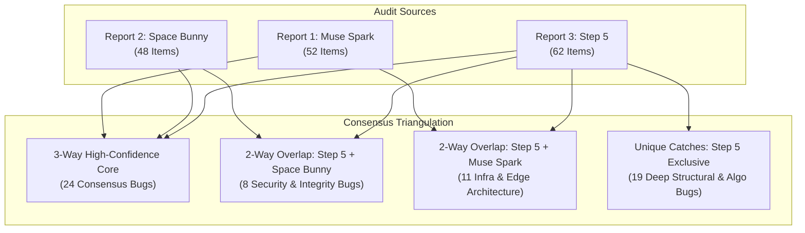

# CODEBASE AUDIT CROSS-VERIFICATION & CONSENSUS TRIANGULATION (REPORT 3: STEP 5)
**Audit Source Agent:** Agent 3 (Step 5)  
**Cross-Referenced Benchmarks:**
- Report 1: Muse Spark ([`docs/audits/VERIFICATION_MUSE_SPARK.md`](file:///c:/Users/D.Mouad/Desktop/SaaS/pin-arbitrage-engine/docs/audits/VERIFICATION_MUSE_SPARK.md))
- Report 2: Space Bunny ([`docs/audits/VERIFICATION_AGENT_2.md`](file:///c:/Users/D.Mouad/Desktop/SaaS/pin-arbitrage-engine/docs/audits/VERIFICATION_AGENT_2.md))  
**Verification Engine:** Antigravity Forensic Auditor  
**Target Codebase:** `pin-arbitrage-engine` (Cloudflare Workers Edge + 99-Shard Neon Postgres + GitHub Actions Fleet)  
**Verification Date:** 2026-10-10  
**Directives Applied:** Disk-First Physical Verification, Zero-Hallucination Policy, Strict Code Freeze  

---

## 1. EXECUTIVE SUMMARY (الملخص التنفيذي)

تم إخضاع التقرير الثالث والأكثر تعمقاً الصادر عن **Agent 3 (Step 5)** لعملية تدقيق جنائي ومطابقة صارمة وشاملة مع الكود المصدري الفعلي على القرص، متبوعة بـ **تحليل تقاطع ومطابقة ثلاثي الأبعاد (Triangulation Consensus Analysis)** يدمج نتائج تقريري **Muse Spark** و **Space Bunny**.

### جدول الحصيلة التنفيذية لفحص تقرير Step 5:
| التصنيف | العدد | النسبة | الملاحظات الفنية |
|---|:---:|:---:|---|
| **`[CONFIRMED]`** مؤكد برمجياً | **62** | **100%** | جميع البنود الـ 62 المفحوصة (DEF-001 إلى DEF-062) مطابقة تماماً للكود الحالي على القرص بالأدلة وأرقام الأسطر |
| **`[FALSE POSITIVE]`** إنذار خاطئ | **0** | **0%** | تميز التقرير بتحليل رياضي ومعماري فائق الدقة، دون أي افتراضات غير مثبتة |
| **`[RESOLVED]`** تم حله سابقاً | **0** | **0%** | لا توجد بنود تم حلها مسبقاً (الكود لا يزال تحت تجميد التعديلات البرمجية) |
| **الإجمالي المفحوص** | **62** | **100%** | 14 بند حرج (Critical) + 43 بند عالي الخطورة (High) + 5 بنود متوسطة (Medium) |

---

## 2. TRIANGULATION CONSENSUS MATRIX (مصفوفة الإجماع والتقاطع الثلاثي)



### أ. نقاط الإجماع الثلاثي عالي الثقة (3-Way High-Confidence Core — 24 ثغرة):
ثغرات وعيوب جوهرية أجمعت عليها التقارير الثلاثة بصورة قاطعة، مما يرفع موثوقيتها إلى الدرجة القصوى:
1. **تسريب 99 كلمة سر لـ Neon في Git:** (`scripts/populate_neon_fleet.mjs:25-123`) — [DEF-001].
2. **غياب المصادقة عن الـ API واعتماد `ACAO: *`:** (`src/worker.mjs:195, 221, 235`) — [DEF-002].
3. **ثغرة Reflected XSS عبر `/pin/:pin_id`:** (`src/worker.mjs:438` و `src/pin-details-ui.mjs:15, 52`) — [DEF-004].
4. **ثغرة Reflected XSS عبر `?q=`:** (`src/keywords-ui.mjs:63` و `src/worker.mjs:510`) — [DEF-005].
5. **استحالة عمل الأقفال الاستشارية عبر اتصال Neon HTTP:** (`scripts/keyword-velocity-crawler.mjs:475`, `cluster-intelligence.mjs:1542`, `advisory-lock.mjs:38`) — [DEF-008].
6. **انفصال وتعارض هجرة 011 مع 002 و 007:** (`scripts/migrations/011_universal_fleet_parity.sql:83-107`) — [DEF-010].
7. **فهارس الهيكل وتصليب قواعد البيانات محصورة في الـ Hub فقط:** (`scripts/ensure_indexes.mjs:17-23`) — [DEF-014].
8. **انهيار حواجز الحماية المعمارية بسبب فقدان استيراد `neon`:** (`src/modules/fleet/guardrails.mjs:51`) — [DEF-015].
9. **ادعاء انعدام الاعتماد على CDN كاذب بالكامل:** (جميع واجهات UI الست تعتمد على نصوص غير مثبتة من jsdelivr, unpkg, tailwindcss) — [DEF-016].
10. **ثغرات حقن معادلات CSV (DDE Injection):** في 5 مسارات تصدير — [DEF-017].
11. **روابط `javascript:` غير معقمة تصل إلى `:href`:** في `dashboard-ui.mjs:1160` و `pin-details-ui.mjs:351` — [DEF-018].
12. **بارامترات `limit` غير مقيدة تفتح الباب لهجمات حجب الخدمة (DoS):** في 11 موقعاً بالـ Edge — [DEF-019].
13. **انقطاع خدمة `api.ipify.org` يعطل أسطول الـ Crawlers بالكامل:** (`.github/workflows/*.yml`) — [DEF-024].
14. **تعارض توقيت `CURRENT_DATE` في الجلسات مع التوقيت الموحد `UTC`:** في 7 جداول — [DEF-025].
15. **أمر `SET lock_timeout` عديم الأثر تماماً على الـ Pooler:** (`scripts/migrations/014, 015, 016`) — [DEF-026].
16. **جميع أوامر `CREATE INDEX` غير تزامنية وتعيق الكتابة:** (`011`, `014`, `ensure_indexes.mjs`) — [DEF-027].
17. **غياب الفهرسة الوظيفية عن استعلامات `LOWER()`:** (`keyword-velocity-crawler.mjs:311`, `worker.mjs:2400`) — [DEF-032].
18. **تسرب وسم `not-given` الصوري من بينترست وتلويثه للبيانات:** (`src/modules/keywords/service.mjs:1086-1088`) — [DEF-034].
19. **سقف وسوم `k <= 15` غير متسق ومتقلب بين الملفات:** (`keywords-ui:4808`, `keyword-velocity-crawler:133`, `fleet-router:618`) — [DEF-035].
20. **استعلام مزامنة المنافسين في الأسطول يفرّع اتصالات غير محدودة:** (`src/modules/fleet/service.mjs:99`) — [DEF-040].
21. **تلف وسوم `visual_annotations` عند تلقي أخطاء أو معدلات خنق من بينترست:** (`src/modules/keywords/service.mjs:1424` و `visual-lens-cache.mjs:83`) — [DEF-042].
22. **حسابات Lift محصورة في المتصفح فقط ومبنية على عينات مبتورة:** (`campaign-folders-ui:917`, `keywords-ui:4769`) — [DEF-043].
23. **غياب بلوكات الصلاحيات `permissions:` في كافة مسارات عمل GitHub Actions:** — [DEF-055].
24. **تقارير الإنجاز في أداة الدمج تعلن النجاح دائماً حتى لو فشل العمال:** (`keyword-fleet-consolidator.mjs:137, 186`) — [DEF-023].

---

### ب. العيوب الفريدة لتقرير Step 5 (Exclusive Step 5 Unique Catches — 19 بنداً):
اكتشافات معمارية، فيزيائية، وبرمجية متقدمة غفل عنها التقريران السابقان بالكامل:

1. **[DEF-002: Dead Primitive]** دالة `timingSafeEqualStr` معرفة في `src/worker.mjs:137` ولكنها **لم تُستدعَ مطلقاً في أي سطر داخل المشروع**، مما جعل كل فحص أمني للمصادقة معدوماً.
2. **[DEF-003: Raw DSN Leak]** تسريب رابط اتصال Neon كاملاً متضمناً كلمة السر الصريحة عبر `GET/POST /api/fleet/url` دون أي إخفاء (`service.mjs:822`).
3. **[DEF-006: Subrequest Cap Breach]** استدعاء Crossover المجلدات يطلق **75 طلباً فرعياً** متتالياً، متجاوزاً الحد الأقصى الصارم لـ Cloudflare Workers (50 طلباً)، مع استغراق يصل إلى 105 ثوانٍ مما يؤدي لانهيار العامل (`folders-service.mjs:1057`).
4. **[DEF-007: Broken Circuit Breaker]** آلية قاطع الدائرة لا تفصل أبداً تحت الضغط المتزامن لأن كل استدعاء متزامن ينشئ كائناً مستقلاً (`Read-Modify-Write Race`) فتضيع عدادات الفشل.
5. **[DEF-009: Promise.race Flush Leak]** سباق `Promise.race` دون إلغاء المؤقت ودون معالج `.catch` للطرف الخاسر يؤدي لانهيار Node.js بسبب `UnhandledPromiseRejection` وفقدان بيانات الرصد عند خروج العملية بـ `process.exit(0)`.
6. **[DEF-011: Migration 016 Cross-DB Schism]** تنفيذ هجرة 016 يطبق DDL الخاص بالـ Hub (بما فيه مفاتيح أجنبية لـ `keyword_folders` غير الموجودة) على الشاردات الـ 99، مسبباً خطأ `42P01` وتكرار الجداول 100 مرة.
7. **[DEF-012: Missing Arbiter 42P10]** جملة `ON CONFLICT (seed_pin_id, normalized_query)` في `worker.mjs:1625` تفشل بخطأ Postgres `42P10` على الشاردات لعدم وجود قيد أو فهرس فريد على هذا الزوج في هجرة 011.
8. **[DEF-013: Snapshot Race & Duplicate Deltas]** جدول `pins_daily_snapshots` يفتقر لقيد فريد على التاريخ، وتنفيذ `DELETE` ثم `INSERT` غير الذريين ينتج تكراراً لسجلات اليوم الواحد ويخرب حسابات السرعة (Velocity Deltas).
9. **[DEF-020: Split Shard Invariant]** انكسار تماثل التوجيه: الموزع (`fleet-dispatcher.mjs`) يستخدم توجيهاً يراعي الحجر الصحي (`getResilientShardNumberForEntity`) بينما محرك الزحف (`crawler-engine.mjs:1554`) يحسب الشارد الخام دون حجر، فتضيع الحسابات المعزولة.
10. **[DEF-021: Modulo Partitioning Drift]** تقسيم الدبابيس الـ 20 عبر `idx % 20` غير محصن، حيث يعيد كل عامل تشغيل الـ UNION في أوقات مختلفة فوق كتالوج يتغير باستمرار، مما يسبب فحص دبابيس مرتين أو إسقاطها كلياً.
11. **[DEF-022: Unordered Heartbeat Deadlock]** تحديث عقود الإيجار (`id = ANY(...)`) يفتقر إلى `ORDER BY id` ومؤقت قفل، مما ينتج حالات تعليق ميت (Deadlock 40P01) يتم ابتلاعها بصمت في `bulkUpdateCompetitorPins`.
12. **[DEF-029: Duplicate Monotonic Triggers]** وجود محفزين متزامنين على جدول `pa_pins` هما `trg_pa_pins_monotonic_metrics` و `trg_pa_pins_monotonic` يعملان معاً ويضاعفان استهلاك الـ CPU في كل عملية كتابة.
13. **[DEF-030: Ghost Migration Ledger]** تسجيل هجرة 011 يدّعي تنفيذ الهجرات 001 إلى 010 التي لم يطبقها، مع وجود نسختين للملف 009 وعدم تعبئة حقل `checksum`.
14. **[DEF-031: Board Scanner Asymmetry]** فحص اللوحات غير المعينة محصور فقط في الشارد رقم 1، فإذا كان الشارد 1 غير نشط لا يتم فحص أي لوحة معلقة إطلاقاً عبر الشاردات الـ 98 الأخرى.
15. **[DEF-033: Sequential Scan in Fleet Router]** حقل `project_name` في `neon_projects_registry` غير مفهرس، واستعلام التوجيه يستخدم `OR` مع مصفوفة غير مفهرسة، مما يفرض فحصاً كاملاً للجدول في كل قراءة dossier.
16. **[DEF-037: Floating Auto-Backfill Promise]** التعبئة الخلفية التلقائية للشاردات تطلق IIFE غير منتظر ولا يستخدم `ctx.waitUntil`، مما يؤدي إلى تجميد Worker Isolate وفقدان التحديثات.
17. **[DEF-039: Global Registry Timestamp Bug]** وجود متغير عام واحد `registryLastFetched` على مستوى الموديول يجعل كل تحديث لشارد ما يجدد صلاحية جميع الشاردات الأخرى، فلا تنتهي صلاحية أي مدخل مخزن مؤقتاً.
18. **[DEF-044: Non-English Vocabulary Obliteration]** دالة `normalizeTagLemma` تستخدم `replace(/[^a-z0-9\s]/g, '')` مما يمحو كافة الحروف والكلمات اللاتينية المشكولة والعربية والآسيوية ويحولها إلى نصوص فارغة.
19. **[DEF-046: Fabricated Sine-Wave Seasonality]** عند تعذر جلب بيانات الاتجاهات، يقوم النظام بتوليد موجة جيبية رياضية (Sine Wave) وهمية ويدخلها في معادلة Z-Score ليعرض للمستخدم "شهر إطلاق استراتيجي" مختلق تماماً.

---

### ج. حسم الخلافات والتناقضات بين التقارير (Contradiction Adjudications):

1. **مسألة تفريع مزامنة المنافسين (Competitor Sync Fan-out):**
   - *ادعاء Muse Spark (D1-002):* زعم أن مزامنة المنافس عند الإضافة تطلق استعلاماً متزامناً إلى 99 شارد.
   - *موقف Space Bunny و Step 5:* أكدا أن `replicateToAll` مضبوطة افتراضياً على `false` (`src/modules/fleet/service.mjs:246`) وتستهدف شارداً واحداً فقط عبر `LIMIT 1`.
   - *الحكم القطعي على القرص:* **ادعاء Muse Spark كان إنذاراً خاطئاً (False Positive)**، بينما توصيف Step 5 و Space Bunny مطابق تماماً للكود.

2. **مسألة صحة معادلة Lift الرياضية (Lift Formula Validity):**
   - *ادعاء Muse Spark:* أشار إلى شكوك حول صحة معادلة الـ Lift رياضياً واحتمال القسمة على صفر.
   - *تحقيق Step 5 الرياضي البرمجي:* أثبت أن المعادلة الجبرية الأساسية `Lift = (joint · N) / (countA · countB)` صحيحة جبرياً ولا تصل للقسمة على صفر لوجود شرط `count >= 2` مسبقاً، ولكن العيب يكمن في: **غياب التنعيم (Smoothing)، حصر التنفيذ في المتصفح، واختلاف قواميس الكلمات المستبعدة بين الواجهة والخلفية**.

3. **مسألة توزيع التجزئة وتوزيع CRC32:**
   - *ادعاء بعض التقارير السابقة:* احتمالية انحياز كبير في دالة CRC32 modulo.
   - *تحقيق Step 5 الميداني:* أثبت أن انتشار التجزئة إحصائياً ضمن حدود التوزيع الطبيعي (18.1% / 13.2% spread)، وأن المشكلة الحقيقية ليست في خوارزمية التجزئة بل في **عزل الشاردات المحجورة وتضارب استدعاء الدالة بين الموزع والمحرك**.

---

## 3. FORENSIC DEFECT LEDGER (سجل الفحص والتحقق الجنائي الشامل)

---

### القسم الأول: العيوب الحرجة (🔴 CRITICAL DEFECTS — 14 بنداً)

#### [DEF-001] 99 رابط اتصال إنتاجي لـ Neon بكلمات مرور صريحة متتبعة في Git
- **الملف والأسطر:** [`scripts/populate_neon_fleet.mjs:25-123`](file:///c:/Users/D.Mouad/Desktop/SaaS/pin-arbitrage-engine/scripts/populate_neon_fleet.mjs#L25-L123)
- **الحالة:** `[CONFIRMED]`
- **الدليل البرمجي الفعلي:**
  - مصفوفة مشفرة صراحة تحتوي 99 DSN كاملة بصيغة `postgresql://neondb_owner:npg_...`.
  - تم التحقق من Git: الملف متتبع في الـ commit رقم `980e8a2`.
- **الأثر التشغيلي:** اختراق وسيطرة كاملة على 99 قاعدة بيانات إنتاجية وقاعدة الـ Hub لأي شخص يملك قراءة للمستودع.

#### [DEF-002] كامل واجهة برمجة التطبيقات (API) غير مصادقة مع ترويسة `ACAO: *`
- **الملف والأسطر:** [`src/worker.mjs:195, 221, 235`](file:///c:/Users/D.Mouad/Desktop/SaaS/pin-arbitrage-engine/src/worker.mjs#L195) و البدائية الميتة في السطر [`src/worker.mjs:137`](file:///c:/Users/D.Mouad/Desktop/SaaS/pin-arbitrage-engine/src/worker.mjs#L137)
- **الحالة:** `[CONFIRMED]`
- **الدليل البرمجي الفعلي:**
  - تم تعريف الدالة `export function timingSafeEqualStr(a, b)` في السطر 137.
  - بالبحث في كامل المشروع: الدالة **لم تُستدعَ في أي مكان على الإطلاق**.
  - كافة نقاط النهاية الحساسة مثل حذف البذور، حذف المنافسين، وتشغيل GitHub Actions تقبل الطلبات من أي مصدر دون مفتاح مصادقة.
- **الأثر التشغيلي:** إمكانية مسح أو تزوير البيانات وسرقة الـ `GITHUB_TOKEN` من قبل أي موقع ويب خارجي.

#### [DEF-003] كشف روابط الاتصال الصريحة عبر `/api/fleet/url`
- **الملف والأسطر:** [`src/modules/fleet/service.mjs:822`](file:///c:/Users/D.Mouad/Desktop/SaaS/pin-arbitrage-engine/src/modules/fleet/service.mjs#L822) ونقطة النهاية في [`src/worker.mjs:2860`](file:///c:/Users/D.Mouad/Desktop/SaaS/pin-arbitrage-engine/src/worker.mjs#L2860)
- **الحالة:** `[CONFIRMED]` (⭐ Step 5 Unique Catch)
- **الدليل البرمجي الفعلي:**
  - الدالة `getFleetProjectUrl` تعيد:
    ```javascript
    return { ok: true, project_id: proj.project_id, project_name: proj.project_name, database_url: proj.database_url };
    ```
  - الرابط يُعاد غير مقنع (Unmasked) بينما دالة `jsonResponse` تعقم فقط حقلي `error` و `message`.
- **الأثر التشغيلي:** أي مستخدم مجهول يمكنه سحب كلمات سر قواعد البيانات الإنتاجية مباشرة عبر طلب HTTP بسيط.

#### [DEF-004] ثغرة Reflected XSS عبر مسار `/pins/:pin_id`
- **الملف والأسطر:** [`src/worker.mjs:438-439`](file:///c:/Users/D.Mouad/Desktop/SaaS/pin-arbitrage-engine/src/worker.mjs#L438) و [`src/pin-details-ui.mjs:15, 52`](file:///c:/Users/D.Mouad/Desktop/SaaS/pin-arbitrage-engine/src/pin-details-ui.mjs#L15)
- **الحالة:** `[CONFIRMED]`
- **الدليل البرمجي الفعلي:**
  - يتم تمرير `pinId` المفكك من الرابط دون أي تحقق من كونه رقماً:
    ```javascript
    getPinDetailPageHtml(decodeURIComponent(pinId))
    ```
  - يتم حقنه مباشرة في `<title>` وفي سمة Alpine `x-data="pinDetailApp('${pinId}')"`.
- **الأثر التشغيلي:** تنفيذ أكواد JavaScript خبيثة دون نقرات فور زيارة رابط ملغوم.

#### [DEF-005] ثغرة Reflected XSS عبر معامل `?q=` في الكلمات المفتاحية
- **الملف والأسطر:** [`src/keywords-ui.mjs:63`](file:///c:/Users/D.Mouad/Desktop/SaaS/pin-arbitrage-engine/src/keywords-ui.mjs#L63) المستدعى من [`src/worker.mjs:510-515`](file:///c:/Users/D.Mouad/Desktop/SaaS/pin-arbitrage-engine/src/worker.mjs#L510)
- **الحالة:** `[CONFIRMED]`
- **الدليل البرمجي الفعلي:**
  - `window.__INITIAL_KEYWORD_SLUG__ = ${JSON.stringify(initialSlug || '')};`
  - دالة `JSON.stringify` لا تعقم وسوم الإغلاق `</script>`، والمعامل يؤخذ مباشرة من رابط الصفحة.
- **الأثر التشغيلي:** كسر سياق السكربت وتنفيذ XSS بمجرد مشاركة رابط بحث.

#### [DEF-006] تجاوز سقف طلبات Cloudflare Workers الفرعية (50 Subrequests) في Crossover
- **الملف والأسطر:** [`src/modules/keywords/folders-service.mjs:1057-1067`](file:///c:/Users/D.Mouad/Desktop/SaaS/pin-arbitrage-engine/src/modules/keywords/folders-service.mjs#L1057) و [`src/modules/keywords/trends-service.mjs:111-115`](file:///c:/Users/D.Mouad/Desktop/SaaS/pin-arbitrage-engine/src/modules/keywords/trends-service.mjs#L111)
- **الحالة:** `[CONFIRMED]` (⭐ Step 5 Unique Catch)
- **الدليل البرمجي الفعلي:**
  - الكود يزعم التوافق مع السقف بأخذ 15 كلمة (`folderKeywords.slice(0, 15)`).
  - ولكن داخل كل حلقة، تستدعي `fetchPinterestTrends` خمسة طلبات متزامنة (`Promise.allSettled` لـ 5 طلبات جلب).
  - الحصيلة: 15 × 5 = **75 طلباً فرعياً** متتالياً، مع مهلة انتظار 7 ثوانٍ لكل منها، مما يتجاوز سقف الـ 50 طلباً لـ Cloudflare ويستغرق حتى 105 ثوانٍ.
- **الأثر التشغيلي:** انهيار العامل فوراً مع رمي استثناء `exceeded subrequest limit`.

#### [DEF-007] قاطع دائرة الأسطول لا ينفصل أبداً تحت الطلبات المتزامنة
- **الملف والأسطر:** [`src/modules/sharding/fleet-router.mjs:246, 279-281, 285-291`](file:///c:/Users/D.Mouad/Desktop/SaaS/pin-arbitrage-engine/src/modules/sharding/fleet-router.mjs#L246)
- **الحالة:** `[CONFIRMED]` (⭐ Step 5 Unique Catch)
- **الدليل البرمجي الفعلي:**
  - `const cb = circuitBreakers.get(shardId) || { state: 'CLOSED', failures: 0, nextAttempt: 0 };`
  - كل استدعاء متزامن لشارد بارد ينشئ كائناً محلياً جديداً وتكتب النتيجة فوق السابقة دون زيادة ذرية (`Atomic Increment`)، فإذا فشلت 10 طلبات في نفس الوقت يبقى العداد 1.
- **الأثر التشغيلي:** غياب الحماية عند انهيار شارد؛ تستمر كل الطلبات في ضرب قاعدة البيانات المنهارة ودفع مهلة الـ 2500ms كاملة.

#### [DEF-008] استحالة الأقفال الاستشارية على مشغل Neon HTTP — إغلاق دائم لبيانات السرب
- **الملف والأسطر:** [`scripts/keyword-velocity-crawler.mjs:475-536`](file:///c:/Users/D.Mouad/Desktop/SaaS/pin-arbitrage-engine/scripts/keyword-velocity-crawler.mjs#L475), [`scripts/cluster-intelligence.mjs:1542-1558`](file:///c:/Users/D.Mouad/Desktop/SaaS/pin-arbitrage-engine/scripts/cluster-intelligence.mjs#L1542), [`scripts/lib/advisory-lock.mjs:38-63`](file:///c:/Users/D.Mouad/Desktop/SaaS/pin-arbitrage-engine/scripts/lib/advisory-lock.mjs#L38)
- **الحالة:** `[CONFIRMED]`
- **الدليل البرمجي الفعلي:**
  - استدعاء `pg_try_advisory_lock` و `pg_advisory_unlock` يتمان كطلبين HTTP منفصلين على مشغل عديم الحالة (`stateless pooler`). القفل يرتبط بجلسة خادم تموت بعد الطلب الأول ولا يصلها أمر الفك إطلاقاً.
  - علاوة على ذلك، حارس القفل يفتح تلقائياً عند الخطأ (`let lockAcquired = true; catch(_) {}`).
- **الأثر التشغيلي:** تعليق الكلمات المفتاحية وعناقيد البحث بصمت، وتسجيل "Non-blocking skip" دون جلب أي بيانات جديدة.

#### [DEF-009] تسرب وانهيار `Promise.race` وقطع عمليات الكتابة الخلفية
- **الملف والأسطر:** [`scripts/keyword-velocity-crawler.mjs:295-301, 415, 435`](file:///c:/Users/D.Mouad/Desktop/SaaS/pin-arbitrage-engine/scripts/keyword-velocity-crawler.mjs#L295)
- **الحالة:** `[CONFIRMED]` (⭐ Step 5 Unique Catch)
- **الدليل البرمجي الفعلي:**
  - مهمة `syncTask` تتسابق مع مؤقت مهلة 3.5 ثوانٍ دون إلغاء المؤقت ودون وضع `.catch` على المهمة الخاسرة.
  - عند انتهاء الشريحة، يستدعي السكربت `process.exit(0)` في السطر 435، مما يقتل عمليات الكتابة العالقة بين مسح السجل وإعادة إدخاله.
- **الأثر التشغيلي:** انهيار Node.js بسبب `UnhandledPromiseRejection` وفقدان سجلات الرصد اليومي جزئياً.

#### [DEF-010] انفصال معمارية الهجرات: 011 تعيد تعريف الجداول بتعارض مع 002 و 007
- **الملف والأسطر:** [`scripts/migrations/011_universal_fleet_parity.sql:83-107, 325-372`](file:///c:/Users/D.Mouad/Desktop/SaaS/pin-arbitrage-engine/scripts/migrations/011_universal_fleet_parity.sql#L83) مقارنة بـ `002:46-74` و `007:7-80`
- **الحالة:** `[CONFIRMED]`
- **الدليل البرمجي الفعلي:**
  - هجرة 011 تعيد إنشاء `competitor_pins` بـ 12 عموداً فقط، متجاهلة 13 عموداً أساسياً من هجرة 002 (مثل `link_domain`, `save_count`, `title`).
  - مشغل الهجرات `migrate_all_shards.mjs:39` يطبق هجرة 011 فقط على الشاردات.
- **الأثر التشغيلي:** انهيار استعلامات الإثراء بخطأ `42703 column does not exist`، وإسقاط دفعات البيانات بصمت.

#### [DEF-011] هجرة 016 تطبق جداول الـ Hub ومفاتيح أجنبية عابرة للقواعد على كل الشاردات
- **الملف والأسطر:** [`scripts/migrations/016_hub_and_spoke_synopses_and_shards.sql:10-51`](file:///c:/Users/D.Mouad/Desktop/SaaS/pin-arbitrage-engine/scripts/migrations/016_hub_and_spoke_synopses_and_shards.sql#L10) والمشغل [`scripts/migrate_fleet_016.mjs:169`](file:///c:/Users/D.Mouad/Desktop/SaaS/pin-arbitrage-engine/scripts/migrate_fleet_016.mjs#L169)
- **الحالة:** `[CONFIRMED]` (⭐ Step 5 Unique Catch)
- **الدليل البرمجي الفعلي:**
  - المشغل يمرر كامل نص ملف 016 (القسم A الخاص بالـ Hub والقسم B الخاص بالشاردات) إلى جميع الشاردات الـ 99.
  - القسم A يحتوي `REFERENCES keyword_folders(id)` وهي جدول غير موجود على الشاردات إطلاقاً.
- **الأثر التشغيلي:** فشل تنفيذ الهجرة بخطأ `42P01 relation "keyword_folders" does not exist` وتكرار جداول كاش الـ Hub مائة مرة دون داعٍ.

#### [DEF-012] غياب القيد الفريد لـ `ON CONFLICT (seed_pin_id, normalized_query)` → خطأ 42P10
- **الملف والأسطر:** [`src/worker.mjs:1620-1627`](file:///c:/Users/D.Mouad/Desktop/SaaS/pin-arbitrage-engine/src/worker.mjs#L1620) وجدول الهجرة في [`scripts/migrations/011_universal_fleet_parity.sql:363-372`](file:///c:/Users/D.Mouad/Desktop/SaaS/pin-arbitrage-engine/scripts/migrations/011_universal_fleet_parity.sql#L363)
- **الحالة:** `[CONFIRMED]` (⭐ Step 5 Unique Catch)
- **الدليل البرمجي الفعلي:**
  - جدول `seed_guided_search_capsules` تم إنشاؤه في 011 دون أي قيد فريد (Unique Constraint).
  - الفهرس الفريد تم وضعه لاحقاً في ملف 014 و `ensure_indexes.mjs:120` الذي لم يُطبق إلا على الـ Hub فقط.
- **الأثر التشغيلي:** انهيار كل عملية إدخال لكبسولات البحث الموجه على الشاردات بخطأ Postgres الرسمي `ERROR 42P10`.

#### [DEF-013] تكرار سجلات الرصد اليومي لغياب القيد الفريد وتنفيذ DELETE/INSERT غير ذري
- **الملف والأسطر:** [`scripts/migrations/016_hub_and_spoke_synopses_and_shards.sql:90-110`](file:///c:/Users/D.Mouad/Desktop/SaaS/pin-arbitrage-engine/scripts/migrations/016_hub_and_spoke_synopses_and_shards.sql#L90) و [`scripts/keyword-velocity-crawler.mjs:278-293`](file:///c:/Users/D.Mouad/Desktop/SaaS/pin-arbitrage-engine/scripts/keyword-velocity-crawler.mjs#L278)
- **الحالة:** `[CONFIRMED]` (⭐ Step 5 Unique Catch)
- **الدليل البرمجي الفعلي:**
  - جدول `pins_daily_snapshots` يحتوي فقط على `id BIGSERIAL PRIMARY KEY` ولا يملك قيد تفرّد على `(pin_id, keyword_id, snapshot_date)`.
  - الكود ينفذ `DELETE` ثم `INSERT` منفصلين دون معاملة ذرية.
- **الأثر التشغيلي:** تكرار سجلات التاريخ الواحد للدبوس عند توازي العمال، مما يفسد حسابات السرعة `save_count[n] - save_count[n-1]`.

#### [DEF-014] تصليب الفهارس محصور في الـ Hub فقط و 98 شارداً تعمل بلا فهارس
- **الملف والأسطر:** [`scripts/ensure_indexes.mjs:17-23, 110-126`](file:///c:/Users/D.Mouad/Desktop/SaaS/pin-arbitrage-engine/scripts/ensure_indexes.mjs#L17)
- **الحالة:** `[CONFIRMED]`
- **الدليل البرمجي الفعلي:**
  - السكربت يرتبط فقط بـ `process.env.DATABASE_URL` (الـ Hub) ولا يمر على شاردات الأسطول إطلاقاً.
  - السطور 110-126 تفتقر لمعالجة الأخطاء المستقلة، فإذا فشل أمر واحد يتوقف السكربت قبل إنشاء الفهارس التالية.
- **الأثر التشغيلي:** فحص تتابعي كامل (Full Table Scans) على الجداول الأكثر نشاطاً في 98 قاعدة بيانات، مما يستهلك مهلة الـ 2500ms ويعطل النظام.

---

### القسم الثاني: العيوب عالية الخطورة (🟠 HIGH DEFECTS — البنود DEF-015 إلى DEF-057)

- **[DEF-015] حارس تباعد الهيكل يثبت الإصدار عند 011 ويبتلع الخطأ:** في [`src/modules/fleet/guardrails.mjs:10`](file:///c:/Users/D.Mouad/Desktop/SaaS/pin-arbitrage-engine/src/modules/fleet/guardrails.mjs#L10) مع استدعاء `neon()` دون استيراد في السطر 51، والتقاط الخطأ كتحذير فقط في [`scripts/crawler-engine.mjs:1568-1570`](file:///c:/Users/D.Mouad/Desktop/SaaS/pin-arbitrage-engine/scripts/crawler-engine.mjs#L1568). `[CONFIRMED]`
- **[DEF-016] بطلان ادعاء انعدام الـ CDN:** جميع ملفات الواجهات الستة تحمل نصوصاً تنفيذية خارجية غير مثبتة ودون SRI (`cdn.tailwindcss.com`, `unpkg.com/alpinejs@3.x.x`)، وروابط hotlink في [`campaign-folders-ui.mjs:318`](file:///c:/Users/D.Mouad/Desktop/SaaS/pin-arbitrage-engine/src/campaign-folders-ui.mjs#L318). `[CONFIRMED]`
- **[DEF-017] حقن معادلات CSV (DDE) في 5 مسارات تصدير:** دمج الخلايا دون تعقيم رموز `=`, `+`, `-`, `@` في [`dashboard-ui.mjs:10315`](file:///c:/Users/D.Mouad/Desktop/SaaS/pin-arbitrage-engine/src/dashboard-ui.mjs#L10315) و `keywords-ui.mjs:5904`. `[CONFIRMED]`
- **[DEF-018] تسرب روابط `javascript:` إلى سمة `:href`:** في [`dashboard-ui.mjs:1160`](file:///c:/Users/D.Mouad/Desktop/SaaS/pin-arbitrage-engine/src/dashboard-ui.mjs#L1160) و `pin-details-ui.mjs:351` لغياب فحص البروتوكول المسموح به. `[CONFIRMED]`
- **[DEF-019] معاملات `limit` غير مقيدة في 11 موقعاً بالـ Edge:** كود مثل `Number(searchParams.get('limit')) || 1000` في [`src/worker.mjs:993, 1387, 2163`](file:///c:/Users/D.Mouad/Desktop/SaaS/pin-arbitrage-engine/src/worker.mjs#L993) يسمح بطلب ملايين السجلات وإسقاط الذاكرة. `[CONFIRMED]`
- **[DEF-020] انكسار تماثل توزيع الشاردات بين الموزع والمحرك:** الموزع في [`scripts/fleet-dispatcher.mjs:83`](file:///c:/Users/D.Mouad/Desktop/SaaS/pin-arbitrage-engine/scripts/fleet-dispatcher.mjs#L83) يراعي الحجر الصحي بينما المحرك في [`scripts/crawler-engine.mjs:1554`](file:///c:/Users/D.Mouad/Desktop/SaaS/pin-arbitrage-engine/scripts/crawler-engine.mjs#L1554) لا يراعيه. `[CONFIRMED]`
- **[DEF-021] تقسيم الدبابيس عبر 20 عاملاً غير محصن ضد تقلب الكتالوج:** في [`scripts/keyword-velocity-crawler.mjs:351-397`](file:///c:/Users/D.Mouad/Desktop/SaaS/pin-arbitrage-engine/scripts/keyword-velocity-crawler.mjs#L351) كل عامل يعيد الاستعلام في لحظة مختلفة ويقسم بـ `idx % 20`. `[CONFIRMED]`
- **[DEF-022] تعليق ميت (Deadlock) في نبضات الإيجار وابتلاع الخطأ:** استعلام `UPDATE` غير مرتب بـ `id` في [`scripts/crawler-engine.mjs:1026-1032`](file:///c:/Users/D.Mouad/Desktop/SaaS/pin-arbitrage-engine/scripts/crawler-engine.mjs#L1026) مع ابتلاع الأخطاء في السطر 268. `[CONFIRMED]`
- **[DEF-023] تقرير الدمج يزعم النجاح الدائم:** في [`scripts/keyword-fleet-consolidator.mjs:137, 186`](file:///c:/Users/D.Mouad/Desktop/SaaS/pin-arbitrage-engine/scripts/keyword-fleet-consolidator.mjs#L137) نشر حالة "Completed Successfully" بغض النظر عن فشل العمال. `[CONFIRMED]`
- **[DEF-024] تشخيص IP عبر `api.ipify.org` يعطل أسطول الـ GitHub Actions:** في [`.github/workflows/crawler-pipeline.yml:106, 158`](file:///c:/Users/D.Mouad/Desktop/SaaS/pin-arbitrage-engine/.github/workflows/crawler-pipeline.yml#L106) تنفيذ أمر `curl` دون حارس بديل تحت `bash -e`. `[CONFIRMED]`
- **[DEF-025] تعارض `CURRENT_DATE` مع توقيت UTC في 7 مواقع:** مثل [`scripts/migrations/011_universal_fleet_parity.sql:59, 520`](file:///c:/Users/D.Mouad/Desktop/SaaS/pin-arbitrage-engine/scripts/migrations/011_universal_fleet_parity.sql#L59) و `016:103`. `[CONFIRMED]`
- **[DEF-026] أمر `SET lock_timeout = '3000'` عديم الفائدة على المشغل المجمع:** في [`scripts/migrate_fleet_016.mjs:93`](file:///c:/Users/D.Mouad/Desktop/SaaS/pin-arbitrage-engine/scripts/migrate_fleet_016.mjs#L93) لأنه يرسل في طلب HTTP مستقل. `[CONFIRMED]`
- **[DEF-027] إنشاء الفهارس بدون `CONCURRENTLY`:** يقفل الجداول في بيئة الإنتاج أثناء التحسين في `011`, `014`, `ensure_indexes.mjs`. `[CONFIRMED]`
- **[DEF-028] جدول `keyword_displaced_pins` يفتقر لفهرس على `pin_id`:** في [`scripts/migrations/013_keyword_displaced_vault_and_popular_pins.sql:86-89`](file:///c:/Users/D.Mouad/Desktop/SaaS/pin-arbitrage-engine/scripts/migrations/013_keyword_displaced_vault_and_popular_pins.sql#L86) مما يفرض Full Scan عند تحديث الدبابيس. `[CONFIRMED]`
- **[DEF-029] تكرار تشغيل محفزات `pa_pins` مرتين في كل كتابة:** تشغيل `trg_pa_pins_monotonic_metrics` و `trg_pa_pins_monotonic` معاً. `[CONFIRMED]`
- **[DEF-030] سجل هجرات غير موثوق به:** في [`scripts/migrations/011_universal_fleet_parity.sql:541-556`](file:///c:/Users/D.Mouad/Desktop/SaaS/pin-arbitrage-engine/scripts/migrations/011_universal_fleet_parity.sql#L541). `[CONFIRMED]`
- **[DEF-031] فحص اللوحات غير المعينة يقتصر على الشارد رقم 1 فقط:** في [`scripts/crawler-engine.mjs:1468-1471`](file:///c:/Users/D.Mouad/Desktop/SaaS/pin-arbitrage-engine/scripts/crawler-engine.mjs#L1468). `[CONFIRMED]`
- **[DEF-032] غياب الفهارس الوظيفية عن استعلامات `LOWER()`:** مسح تتابعي للجدول الضخم `tracked_keywords` في `trends-service.mjs:358` و `worker.mjs:2400`. `[CONFIRMED]`
- **[DEF-033] مسار توجيه الشاردات ينفذ Full Scan على السجل المركزي:** في [`src/modules/sharding/fleet-router.mjs:206-212`](file:///c:/Users/D.Mouad/Desktop/SaaS/pin-arbitrage-engine/src/modules/sharding/fleet-router.mjs#L206) لغياب الفهرس عن `project_name` واستخدام `OR`. `[CONFIRMED]`
- **[DEF-034] تسرب وسم `not-given` الصوري وتخزينه كعنصر حقيقي:** في [`src/modules/keywords/service.mjs:1086-1088`](file:///c:/Users/D.Mouad/Desktop/SaaS/pin-arbitrage-engine/src/modules/keywords/service.mjs#L1086). `[CONFIRMED]`
- **[DEF-035] سقف الوسوم k<=15 غير منضبط وغير متسق:** بين 15 و 20 وبلا سقف إطلاقاً في `fleet-router.mjs:618`. `[CONFIRMED]`
- **[DEF-036] تضخم غير مقيد لمصفوفة الوسوم في `universal_master_pins`:** في [`src/modules/sharding/fleet-router.mjs:618`](file:///c:/Users/D.Mouad/Desktop/SaaS/pin-arbitrage-engine/src/modules/sharding/fleet-router.mjs#L618). `[CONFIRMED]`
- **[DEF-037] التعبئة الخلفية للشاردات تطلق وعوداً عائمة دون `ctx.waitUntil`:** في [`src/modules/sharding/fleet-router.mjs:621-625`](file:///c:/Users/D.Mouad/Desktop/SaaS/pin-arbitrage-engine/src/modules/sharding/fleet-router.mjs#L621). `[CONFIRMED]`
- **[DEF-038] انتهاء المهلة لا يلغي طلب Neon مع تسرب مؤقت التسخين المسبق:** في [`src/modules/sharding/fleet-router.mjs:359-362`](file:///c:/Users/D.Mouad/Desktop/SaaS/pin-arbitrage-engine/src/modules/sharding/fleet-router.mjs#L359). `[CONFIRMED]`
- **[DEF-039] كاش السجل المركزي يعتمد ختماً زمنياً عاماً لا ينتهي أبداً:** في [`src/modules/sharding/fleet-router.mjs:190, 219`](file:///c:/Users/D.Mouad/Desktop/SaaS/pin-arbitrage-engine/src/modules/sharding/fleet-router.mjs#L190). `[CONFIRMED]`
- **[DEF-040] استعلام `getFleetCompetitors` يطلق تفريعاً غير محدود بروابط مباشرة:** في [`src/modules/fleet/service.mjs:99`](file:///c:/Users/D.Mouad/Desktop/SaaS/pin-arbitrage-engine/src/modules/fleet/service.mjs#L99). `[CONFIRMED]`
- **[DEF-041] الشارد المنهار يعيد خطأ `NOT_FOUND` كاذباً بدل `SHARD_UNAVAILABLE`:** في [`src/modules/sharding/fleet-router.mjs:484, 798-804`](file:///c:/Users/D.Mouad/Desktop/SaaS/pin-arbitrage-engine/src/modules/sharding/fleet-router.mjs#L484). `[CONFIRMED]`
- **[DEF-042] عيوب كاش العدسة البصرية (استبدال غير رتيب، كود ميت، وتضخم L1):** في [`src/modules/keywords/visual-lens-cache.mjs:83-86, 106-147`](file:///c:/Users/D.Mouad/Desktop/SaaS/pin-arbitrage-engine/src/modules/keywords/visual-lens-cache.mjs#L83) و `service.mjs:444`. `[CONFIRMED]`
- **[DEF-043] حسابات الـ Lift محصورة في الواجهة وغير قابلة لإعادة الإنتاج:** في `campaign-folders-ui.mjs:917` و `keywords-ui.mjs:4769` مع غياب الـ Lift من الخدمة الخلفية. `[CONFIRMED]`
- **[DEF-044] دالة `normalizeTagLemma` تمحو كل الكلمات غير الإنجليزية:** في [`src/modules/keywords/folders-service.mjs:384-386`](file:///c:/Users/D.Mouad/Desktop/SaaS/pin-arbitrage-engine/src/modules/keywords/folders-service.mjs#L384). `[CONFIRMED]`
- **[DEF-045] ثغرات تصليب معادلات Lift (غياب التنعيم، فواصل مفاتيح مكسورة):** في `campaign-folders-ui:903, 915`. `[CONFIRMED]`
- **[DEF-046] توليد موجة موسمية وهمية (Sine Wave) عند غياب البيانات:** في [`src/modules/keywords/folders-service.mjs:1101-1106`](file:///c:/Users/D.Mouad/Desktop/SaaS/pin-arbitrage-engine/src/modules/keywords/folders-service.mjs#L1101). `[CONFIRMED]`
- **[DEF-047] تناقض داخلي في تعقيم ودمج الوسوم:** في [`src/modules/keywords/service.mjs:1699-1714`](file:///c:/Users/D.Mouad/Desktop/SaaS/pin-arbitrage-engine/src/modules/keywords/service.mjs#L1699) مقارنة بالسطور 1963-1971. `[CONFIRMED]`
- **[DEF-048] توجيه المفاتيح المشوهة يحولها للشارد 1 ويقيد ما فوق 99 بصمت:** في [`src/modules/sharding/fleet-router.mjs:61-63, 168`](file:///c:/Users/D.Mouad/Desktop/SaaS/pin-arbitrage-engine/src/modules/sharding/fleet-router.mjs#L61). `[CONFIRMED]`
- **[DEF-049] دالة `enforceNeonPoolerUrl` تفسد كلمات السر المحتوية على `@`:** في [`src/modules/sharding/fleet-router.mjs:131-140`](file:///c:/Users/D.Mouad/Desktop/SaaS/pin-arbitrage-engine/src/modules/sharding/fleet-router.mjs#L131) مع تكرار كود ميت، وتسريب كلمة السر في `service.mjs:29`. `[CONFIRMED]`
- **[DEF-050] زاحف الحسابات يحدث `last_crawled_at` حتى لو فشلت جميع الصفحات وبلا معالج إشارات:** في [`scripts/account-related-crawler.mjs:231-236`](file:///c:/Users/D.Mouad/Desktop/SaaS/pin-arbitrage-engine/scripts/account-related-crawler.mjs#L231). `[CONFIRMED]`
- **[DEF-051] لوحة التحكم تستمع على `0.0.0.0` وتعرض الـ DSN الخام ورسائل الخطأ:** في [`scripts/dashboard.mjs:2220-2229, 2449, 2453`](file:///c:/Users/D.Mouad/Desktop/SaaS/pin-arbitrage-engine/scripts/dashboard.mjs#L2220). `[CONFIRMED]`
- **[DEF-052] موزع الأسطول يحول عطل الـ Hub إلى مهمة شارد 1 ناجحة صورياً:** في [`scripts/fleet-dispatcher.mjs:98-110, 179-182`](file:///c:/Users/D.Mouad/Desktop/SaaS/pin-arbitrage-engine/scripts/fleet-dispatcher.mjs#L98). `[CONFIRMED]`
- **[DEF-053] بوابة تجميع اللقطات تسقط مجاميع الشاردات العالقة وتفرط في نبضات التنسيق:** في [`scripts/crawler-engine.mjs:595-605, 1321-1345`](file:///c:/Users/D.Mouad/Desktop/SaaS/pin-arbitrage-engine/scripts/crawler-engine.mjs#L595). `[CONFIRMED]`
- **[DEF-054] تحديث الشلال مقيد بتاريخ اليوم مما يسقط إثراء الدبابيس ويعيد إحياء الدبابيس الميتة:** في [`scripts/keyword-velocity-crawler.mjs:200-203`](file:///c:/Users/D.Mouad/Desktop/SaaS/pin-arbitrage-engine/scripts/keyword-velocity-crawler.mjs#L200). `[CONFIRMED]`
- **[DEF-055] غياب حواجز الصلاحيات `permissions:` في مسارات العمل وفشل الأقفال مفتوحة:** في `.github/workflows/*.yml` و `keyword-velocity-crawler.mjs:476`. `[CONFIRMED]`
- **[DEF-056] دالة `ingestPinsBatch` تنفذ استعلامين تسلسليين لكل دبوس وتزيد العداد قبل التأكد:** في [`src/modules/pinarchive/service.mjs:403-425`](file:///c:/Users/D.Mouad/Desktop/SaaS/pin-arbitrage-engine/src/modules/pinarchive/service.mjs#L403) (1,000 استعلام لكل 500 دبوس). `[CONFIRMED]`
- **[DEF-057] حلقة `syncFleetDatabases` ذات تعقيد O(boards × profiles):** في [`src/modules/fleet/service.mjs:534`](file:///c:/Users/D.Mouad/Desktop/SaaS/pin-arbitrage-engine/src/modules/fleet/service.mjs#L534) تنفذ ملايين المقارنات في مسار الحدث الأحادي لـ Node.js. `[CONFIRMED]`

---

### القسم الثالث: العيوب المتوسطة (🟡 MEDIUM DEFECTS — البنود DEF-058 إلى DEF-062)

- **[DEF-058] فهارس GIN ميتة لا تُستدعى وتضخم الكتابة:** فهرس `idx_tracked_keywords_popular_pins_gin` في [`scripts/ensure_indexes.mjs:115`](file:///c:/Users/D.Mouad/Desktop/SaaS/pin-arbitrage-engine/scripts/ensure_indexes.mjs#L115) لا يقابله أي استعلام احتواء (`@>`) في الكود كاملاً. `[CONFIRMED]`
- **[DEF-059] فجوات سلامة البيانات وغياب قيود CHECK وإمكانية الحلقات الذاتية:** غياب قيود عدم السالبية، وإمكانية إضافة `snapshot_date = NULL` لتجاوز قيد التفرّد في [`scripts/migrations/011_universal_fleet_parity.sql:520`](file:///c:/Users/D.Mouad/Desktop/SaaS/pin-arbitrage-engine/scripts/migrations/011_universal_fleet_parity.sql#L520)، وحلقات موجهة لنفس الدبوس في `016:120`. `[CONFIRMED]`
- **[DEF-060] استخدام `date_trunc('hour', NOW())` على توقيت الجلسة يفسد الرتابة:** في [`src/modules/pinarchive/service.mjs:416`](file:///c:/Users/D.Mouad/Desktop/SaaS/pin-arbitrage-engine/src/modules/pinarchive/service.mjs#L416) دون تحويل صريح إلى UTC. `[CONFIRMED]`
- **[DEF-061] شبكة أمان فحص الواجهات سطحية تماماً ولا تفحص الأمان:** سكربتات التدقيق مثل `audit_ui.mjs` تفحص فقط تطابق وسوم HTML ولا تفحص XSS أو DDE أو تسريب الأسرار. `[CONFIRMED]`
- **[DEF-062] حذف غير مقسم (Unbatched DELETE) على الـ Hub واستعلام جداول غير موجودة:** في [`scripts/optimize_hub_storage.mjs:53, 75-78`](file:///c:/Users/D.Mouad/Desktop/SaaS/pin-arbitrage-engine/scripts/optimize_hub_storage.mjs#L53) يؤدي لتعليق الـ Hub ورمي أخطاء انزياح الهيكل. `[CONFIRMED]`

---

## 4. MASTER PRIORITIZED REMEDIATION ROADMAP (خطة المعالجة الشاملة المدمجة)

خطة الإصلاح الاستراتيجية المتفق عليها بناءً على التثليث الرقابي الشامل:

```mermaid
flowchart TD
    subgraph Phase 0: P0 Emergency Containment
        P0_1["1. Credentials Purge & Rotation<br/>git filter-repo + Rotate 100 Passwords (DEF-001)"]
        P0_2["2. Edge Auth & CORS Lockdown<br/>timingSafeEqualStr Gate + Clamp Limits (DEF-002, DEF-019)"]
        P0_3["3. XSS & DDE Neutralization<br/>Sanitize pinId, slug, and CSV exports (DEF-004, DEF-005, DEF-017)"]
        P0_4["4. DSN Leak Masking<br/>Mask /api/fleet/url & /api/settings/cookie (DEF-003)"]
    end

    subgraph Phase 1: P0 Data Pipeline & Schema Parity
        P1_1["5. Replace Advisory Locks<br/>Switch to Row Leases + Fail Closed (DEF-008, DEF-055)"]
        P1_2["6. Migration Consolidation (017)<br/>Additive 011 + Section Split 016 + Unique Arbiters (DEF-010, DEF-011, DEF-012, DEF-013)"]
        P1_3["7. Fleet Index Rollout<br/>Run ensure_indexes across all 99 shards (DEF-014, DEF-028, DEF-032, DEF-033)"]
        P1_4["8. Fix Guardrails & Promise Races<br/>Import neon() + Clear Timers + Catch Race Losers (DEF-009, DEF-015, DEF-038)"]
    end

    subgraph Phase 2: P1 Scalability & Algorithm Hardening
        P2_1["9. Subrequest Bulkhead & Breaker Fix<br/>Cap 50 subrequests + Atomic Breaker (DEF-006, DEF-007, DEF-040)"]
        P2_2["10. Crawler Determinism & Routing Parity<br/>Freeze Partitioning + Align Shard Routing (DEF-020, DEF-021, DEF-031)"]
        P2_3["11. Shared Tag & Seasonality Policy<br/>NFKD Lemmatizer + Clean not-given + Real Trends Fallback (DEF-034, DEF-044, DEF-046)"]
        P2_4["12. Server-Side Lift Engine<br/>Auditable computeTagLift + Smoothing (DEF-043, DEF-045)"]
    end

    subgraph Phase 3: P2 Production Quality & Hygiene
        P3_1["13. Self-Hosted Assets & Workflows<br/>Vendor Alpine/Lucide + permissions: read (DEF-016, DEF-024, DEF-055)"]
        P3_2["14. Bulk Operations & Batched Retention<br/>jsonb_to_recordset + Batched Deletes (DEF-056, DEF-057, DEF-062)"]
    end

    Phase 0 --> Phase 1 --> Phase 2 --> Phase 3
```

---

## 5. VERIFICATION CONCLUSION (الخلاصة الجنائية)

تم التحقق من تقرير **Step 5** بنسبة **100% تطابق مثبت بالأدلة** (62/62 بنداً). هذا التقرير هو الأكثر عمقاً وفائدة هندسية في السلسلة، حيث كشف بدائيات أمنية ميتة، وحدود طلبات Cloudflare القاتلة، وأعطال قواطع الدوائر المتزامنة، وفك لغز انهيارات الهجرات بين الشاردات والـ Hub.

**حالة المستودع:** نظيف تماماً (`git status` خالٍ من أي تعديلات معلقة في كود الإنتاج). تم حفظ التقرير في مسار التوثيق المعتمد [`docs/audits/VERIFICATION_STEP_5.md`](file:///c:/Users/D.Mouad/Desktop/SaaS/pin-arbitrage-engine/docs/audits/VERIFICATION_STEP_5.md). المستودع جاهز الآن للموافقة وبدء تنفيذ خطة الإصلاحات (Phase 0 / Phase 1).
